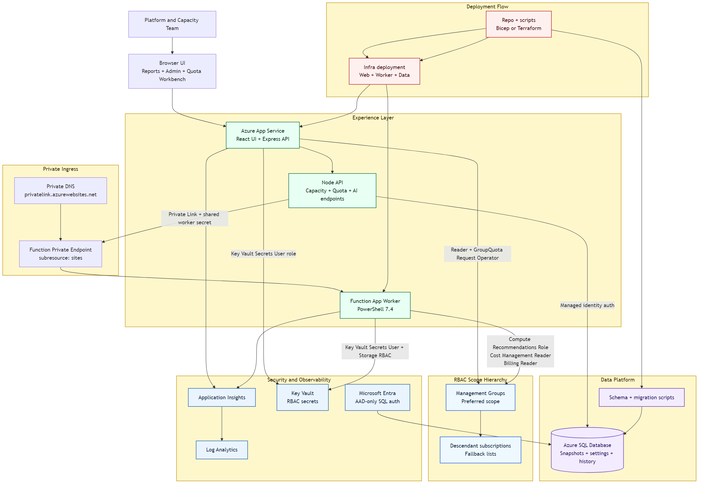
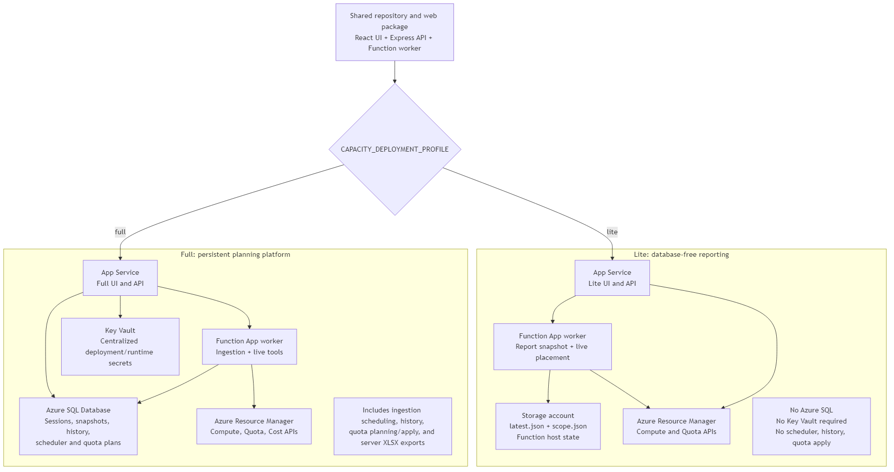
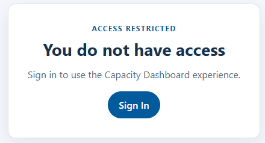

# Capacity Planning Dashboard

This repository contains the initial platform scaffold for a native Azure capacity planning solution.
- Huge shout out to Zach Luz for builing out many of the API calls this solution utilizes in his repo: https://github.com/ZacharyLuz/Get-AzVMAvailability

## Current Release

Current version: `v1.0.5`

This version fixes Report Matrix filtering for West US 3 and keeps Family Base filters switchable after choosing a D/E/N/H/etc. SKU base.

Key fixes in `v1.0.5`:

- Added West US 3 (`westus3`) to the East/West and US Major report presets so it appears in the Report Matrix without switching to Global.
- Kept the Family Base dropdown populated from the broader report scope so selecting `D` does not trap the filter and prevent switching to `E` or another base.
- Added a regression test that locks West US 3 into the US reporting presets.

Previous release: `v1.0.4` — build-time React compilation and top-bar release metadata.

Release history is tracked in `docs/RELEASE-NOTES.md`. Git tags should use the same version string as the release, for example `v1.0.5`, so others can retrieve the exact code behind a deployed version.


## What's new for deployments

### Lite deployment profile

Set `CAPACITY_DEPLOYMENT_PROFILE=lite` for the database-free **Capacity Dashboard Lite** edition. Lite exposes the live **Capacity Recommender** and **Capacity Spot Score** workflows, plus the Capacity Grid and Region/Report Matrix backed by a worker-generated JSON snapshot. It does not run SQL schema initialization, SQL-backed session persistence, ingestion, quota planning, history, or write operations.

The dedicated Function App captures the report scan on a six-hour timer and stores the latest report at `capacity-report-snapshots/latest.json` in its storage account. The dashboard reads that snapshot through its authenticated API; report pages do not depend on a user running the Capacity Recommender first. Administrators can request an on-demand refresh from the report experience.

Lite is intended for a separate App Service and must not replace an existing full dashboard deployment. It requires the same Entra and Azure RBAC prerequisites needed for the live tools, but does not require Azure SQL or database bootstrap. Configure App Service Easy Auth or run a single instance when using application-managed authentication, because Lite intentionally does not use the production SQL session store.

Create and deploy a separate Lite site with:

```powershell
./scripts/deploy-lite-web-app.ps1 `
	-ResourceGroupName "rg-capdash-lite-dev" `
	-AppName "app-capdash-lite-dev-<unique-suffix>" `
	-ManagementGroupNames "<customer-management-group-name>" `
	-AuthEnabled $true `
	-EntraTenantId "<tenant-id>" `
	-EntraClientId "<app-client-id>" `
	-EntraClientSecret "<app-client-secret>" `
	-ReportViewerGroupIds "<capacity-report-viewers-group-object-id>"
```

The guided installer also supports the same SQL-free route from the shared package:

```powershell
./scripts/Start-CapacityDeployment.ps1 -DeploymentProfile Lite
```

Choose **Lite** to provision only the web app, Function worker, worker storage, required network resources, Entra configuration, and Azure RBAC. It sets `CAPACITY_DEPLOYMENT_PROFILE=lite` so the shared React bundle presents the snapshot-based Lite UI. It does not provision Azure SQL, Key Vault, SQL session storage, database schema/bootstrap, or SQL-backed scheduler and quota workflows. Choose **Full** (the default) for the existing Bicep or Terraform SQL-backed deployment path.

The script creates separate web and Function App Service plans, an identity-based worker storage account, a dedicated VNet, and private endpoints plus private DNS zones for the storage Blob, Queue, Table, and File services. It then integrates the Function App with the VNet, assigns managed identities, sets `CAPACITY_DEPLOYMENT_PROFILE=lite`, and uses the normal package deployment gate. It never creates, configures, or initializes Azure SQL. The default VNet ranges are configurable through the `VirtualNetwork*` and subnet parameters when they overlap an existing network. Use `-SubscriptionId` for a known subscription list, or `-ManagementGroupNames` for a comma-separated parent scope. The script assigns the worker `Reader` and `Compute Recommendations Role` at each supplied subscription and management group; the deployment operator must be allowed to create those role assignments. Management-group scope is an operator/deployment setting, not a report-viewer control. The worker resolves descendant subscriptions into each snapshot, so they appear in the Lite filter and live-placement selector.

For an existing Lite deployment, Capacity Admins can update the snapshot scope after deployment in **Admin -> Data Ingestion**. Enter one or more comma-separated subscription IDs and/or management-group names, select **Save Azure Scope**, then select **Refresh Report Data**. The saved scope is stored at `capacity-report-snapshots/scope.json`; the next snapshot populates the report and sidebar subscription filter from its captured subscriptions.

Saving scope changes does not grant Azure permissions. Before scanning a newly selected subscription or management group, a platform operator must grant the worker managed identity `Reader` and `Compute Recommendations Role` at that scope. Use the bootstrap script when those app settings and role assignments need to be configured together:

```powershell
./scripts/Set-LiteCapacityScope.ps1 `
	-ResourceGroupName "capacity-lite-dev" `
	-FunctionAppName "func-capdash-lite-dev-cap001" `
	-ManagementGroupNames "<customer-management-group-name>" `
	-AzureSubscriptionId "<hosting-subscription-id>"
```

This is an operator-only action. It updates the Function App fallback scope settings and assigns its managed identity `Reader` and `Compute Recommendations Role` at the declared scope. Then use **Refresh Report Data** from Capacity Grid or Region Matrix to create the first snapshot; the subscription filter is populated from that captured report.

**Recommended starting point for first-time or customer deployments:** use the guided deployment wizard. It walks the operator through the setup conversation before anything is deployed, including provider, subscription, naming, authentication, Entra group strategy, existing shared services, RBAC scope, package publishing, and database bootstrap.

Run it from PowerShell 7 (`pwsh`) at the repository root:

```powershell
pwsh
./scripts/Start-CapacityDeployment.ps1
```

## License

This project is licensed under the terms of the [MIT License](LICENSE).

## What is included now

- Web UI with tabs, filters, action buttons, and a data grid
- Backend API foundation with capacity endpoints
- SQL schema for snapshots and latest-capacity view
- Azure infrastructure Bicep templates
- Deployment and sample data scripts
- Non-technical Word-friendly deployment guide in `docs/Capacity-Dashboard-Deployment-Guide.rtf`
- Current-state architecture diagram source and rendered image in `docs/`

## Architecture

- Primary editable source (Draw.io): [docs/current-architecture.drawio](docs/current-architecture.drawio)
- Current-state Mermaid source: [docs/current-architecture.mmd](docs/current-architecture.mmd)
- Rendered PNG: [docs/current-architecture.png](docs/current-architecture.png)
- Deployment profile comparison: [docs/deployment-profile-comparison.md](docs/deployment-profile-comparison.md)
- Editable Lite versus Full comparison: [docs/deployment-profile-comparison.excalidraw](docs/deployment-profile-comparison.excalidraw)
- Lite versus Full Mermaid source: [docs/deployment-profile-comparison.mmd](docs/deployment-profile-comparison.mmd)
- Rendered Lite versus Full PNG: [docs/deployment-profile-comparison.png](docs/deployment-profile-comparison.png)





The current-state diagram reflects what is deployed now: App Service hosting the static UI + Express API, Azure SQL with Entra-only auth, managed identity database access, Key Vault RBAC integration, Function App worker private ingress through Private Link, and App Insights/Log Analytics.

Version `v1.0.3` validates the next security posture in isolated Bicep/Terraform app pairs: Web App Easy Auth, Function App Easy Auth, browser login through App Service Authentication, Entra-authenticated dashboard-to-worker calls, temporary Function public access only during worker zip publish, database bootstrap through the deployed Web App, and worker storage private endpoint support. Bicep and Terraform now expose the Easy Auth settings; production rollout still needs the final customer automation-caller decision before `INGEST_API_KEY` can become optional.

The next execution split is now scaffolded in-repo: a dedicated Azure Functions PowerShell 7 worker host under `functions/CapacityWorker/` for live placement and future quota move/apply orchestration.

Use Draw.io for edits when readability/layout precision matters; keep the Mermaid file for quick text-based diffs and automation-friendly rendering.

## Implementation Status

Status legend:

- `[x]` Complete
- `[~]` In progress / partial
- `[ ]` Planned

### Track summary

| Track | Current Status | Notes |
| --- | --- | --- |
| Platform and infrastructure | `[x]` | App Service, SQL, Key Vault, App Insights, Log Analytics deployed via Bicep |
| Worker execution host | `[~]` | Azure Functions PowerShell 7 worker runs on a dedicated App Service plan with managed-identity host storage; live placement worker still needs module restore validation |
| Security and identity | `[~]` | Entra admin + AAD-only SQL auth, managed identity runtime access, no raw subscription IDs stored in snapshots; dashboard auth flow is enabled; Easy Auth hardening is validated for Bicep and Terraform in `v1.0.3` |
| Live ingestion pipeline | `[x]` | Internal ingestion endpoint + scheduler; family filtering is optional (omit `INGEST_QUOTA_FAMILY_FILTERS` to ingest all families) + SQL snapshot writes |
| API and analytics | `[~]` | Capacity API, subscription catalog, family summary, masked subscription summary, and trend APIs complete; quota discovery, plan, simulation, and apply APIs are live |
| UX and dashboard | `[~]` | Capacity grid, filters (region, resource type, SKU family search, availability, subscription), sidebar report navigation, analytics tables, and chart views complete; export/workflow pages still pending |
| Quota movement orchestration | `[~]` | Discover, capture, plan, simulate, and apply flows are live; approval workflow and request tracking still pending |
| Operations and release | `[~]` | Deployment scripts and migration scripts complete; CI/CD pipeline and runbooks still pending |

### Detailed checklist

#### Platform and infrastructure

- [x] Azure resource group and core resources provisioned
- [x] Bicep-based environment deployment script
- [x] SQL schema for snapshots and latest view
- [x] Draw.io + Mermaid architecture artifacts in `docs/`
- [x] Azure Functions worker scaffold and Bicep resources for PowerShell 7 execution

#### Security and identity

- [x] SQL configured with Entra admin and AAD-only auth
- [x] App Service system-assigned managed identity enabled
- [~] App identity database roles are granted post-deploy through the database bootstrap flow or `scripts/initialize-database.ps1` when the SQL team owns the server lifecycle
- [x] Internal ingestion endpoints protected by `INGEST_API_KEY`
- [x] Subscription identities masked (`subscriptionKey`) in stored analytics rows
- [x] Entra sign-in, admin group gating, and report viewer group gating enabled via dashboard auth flow, `ADMIN_GROUP_ID`, and `REPORT_VIEWER_GROUP_IDS`
- [~] Easy Auth hardening validated on isolated Bicep/Terraform Web/Function apps: anonymous Web API calls return `401`, `x-ingest-key` alone returns `401`, bearer-authenticated internal diagnostics return `200`, and worker calls run through Function App Easy Auth

Dashboard report access is controlled separately from administrator access. Users must either be in the admin group configured by `ADMIN_GROUP_ID` or in one of the report viewer groups configured by `REPORT_VIEWER_GROUP_IDS`. The current viewer group is named `CapacityReportViewers`; add users to that Entra group before asking them to sign in to the dashboard.

The Entra app registration used by `ENTRA_CLIENT_ID` must emit group Object IDs in the ID token. In Microsoft Entra admin center, open the app registration, go to **Token configuration**, add a **Groups** claim, select **Security groups**, expand **ID**, and keep **Group ID** selected. Without that token claim, users can sign in but the dashboard cannot see `CapacityAdmin` or `CapacityReportViewers` membership, so `/api/auth/me` returns `canAccessAdmin: false` and `isReportViewer: false` even when the Entra group membership is correct.

If a user is not signed in, or signs in without membership in `CapacityReportViewers` or another configured viewer group, the React app shows the Access Restricted screen with the message `You do not have access` or `Report access is not enabled for your account`. That screen is expected behavior when the viewer group claim is missing from the user's token.



Troubleshooting `Report access is not enabled for your account`:

1. Check the deployed app's auth diagnostics at `https://<web-app-name>.azurewebsites.net/api/auth/me`.
2. If `adminGroupConfigured` and `reportViewerGroupConfigured` are `true`, but `groupClaimPresent` is `false` and `groupCount` is `0`, the app settings are present but the signed-in token does not contain Entra group IDs.
3. Open the Microsoft Entra app registration used by `ENTRA_CLIENT_ID`.
4. Go to **Token configuration**.
5. Add a **Groups** claim.
6. Select **Security groups**, expand **ID**, and keep **Group ID** selected.
7. Save the app registration change, then restart the App Service so new sessions use the current configuration.
8. Have the affected user visit `/auth/logout`, close the browser or use an InPrivate window, sign in again, and recheck `/api/auth/me`. A working token should show `groupClaimPresent: true` and `isReportViewer: true` for members of `CapacityReportViewers`.

##### Session persistence configuration

**`SESSION_STORE_SQL_ENABLED` must always be `true`** for production deployments and any environment with authentication enabled. This setting is hardcoded to `true` in both Bicep and Terraform infrastructure templates by default.

When `SESSION_STORE_SQL_ENABLED=true`, Express sessions are persisted in Azure SQL. This ensures:
- OAuth state and session data survive across app instance restarts and scale-out scenarios
- Multi-instance deployments do not lose authentication state during traffic routing
- Sign-in flows complete successfully without getting stuck in redirect loops

Without SQL-backed sessions (memory-only storage), authentication state becomes ephemeral and instance-specific, causing sign-in loops in scaled or restarted environments. The infrastructure templates apply this setting automatically, but manual deployments or non-standard configurations should verify `SESSION_STORE_SQL_ENABLED=true` is set on all App Service instances hosting the dashboard.

See [infra/README.md](infra/README.md) for additional session and VNet configuration details.

#### Live ingestion pipeline

- [x] Managed identity token flow for ARM ingestion
- [x] Region preset ingestion (`USMajor`)
- [x] Family filter ingestion — optional; set `INGEST_QUOTA_FAMILY_FILTERS` to a comma-separated list to restrict, or omit entirely to ingest all VM families
- [x] Ingestion scheduler (DB-backed admin settings with environment fallback)
- [ ] Move recurring scheduler execution to Function App TimerTrigger jobs (ingestion + live placement)
- [~] Harden Function App worker ingress with App Service Authentication / Microsoft Entra auth: app code, Bicep/Terraform knobs, and isolated smoke tests are complete in `v1.0.3`; production allow-lists and promotion runbooks remain
- [ ] Retry/backoff and dead-letter behavior for ingestion failures

#### API and analytics

- [x] `GET /api/capacity`
- [x] `GET /api/capacity/paged` (server-side pagination for primary grid)
- [x] `GET /api/subscriptions` (subscription search/paging source for multi-select UX)
- [x] `GET /api/capacity/families` (quota-style family summary)
- [x] `GET /api/capacity/subscriptions` (masked subscription summary)
- [x] `GET /api/capacity/trends` (daily or hourly trend rollups)
- [x] `GET /api/capacity/scores` (derived capacity score view with desired-count-aware live snapshot reads)
- [x] `POST /api/capacity/scores/live` (scoped live placement refresh for one subscription + one family)
- [x] `POST /api/capacity/recommendations` (worker-first recommendation flow with diagnostics and fallback handling)
- [x] `POST /internal/ingest/capacity`
- [x] `GET /internal/ingest/status`
- [x] `GET /api/quota/groups` live implementation
- [x] Quota movement plan/simulate/apply endpoints

#### UX and dashboard

- [x] Capacity Explorer tab with filters and grid
- [x] Region group defaulting (`USMajor`)
- [x] Subscription checkbox list with auto-select on first load
- [ ] Move subscriptions into a flyout filter section on the right-hand side of the screen
- [x] Resource Type filter (Compute / Disk / Other / All) scopes the SKU Family dropdown
- [x] SKU Family live search text input with filtered results dropdown alongside it
- [x] SKU family labels formatted for readability (`Standard_Dasv7` instead of `StandardDasv7Family`)
- [x] SKU Family dropdown canonicalization (case-insensitive dedupe + normalized casing/sort for easier lookup)
- [x] Quota Insights tab tables for subscription summary + trends
- [x] Chart views for region availability and top SKU available quota
- [x] Derived High/Medium/Low regional SKU capacity score view in reporting
- [x] On-demand live placement refresh using `Get-AzVMAvailability` placement scores
- [x] Worker-first live placement routing with local fallback for rollback safety
- [x] Capacity Score report legend, last-checked timestamp, and sortable report columns in the React experience
- [x] Live placement refresh is intentionally scoped to exactly one subscription and one family per run to avoid over-broad worker fanout
- [x] Placeholder and aggregate SKUs are filtered out of live refresh requests and report filter lists
- [x] Region-level live placement failures are retried/resolved per region, with unavailable rows persisted as the newest snapshot state
- [x] Capacity Recommender falls back to the local runner when the remote worker fails, and zero-result runs now return clearer warning/detail text
- [x] Ingestion status widget in UI
- [x] Admin ingestion trigger is queued/polled as a background job instead of holding the browser request open
- [x] Admin UI setting for scheduled refresh rates (capacity ingestion and live placement refresh stored in SQL)
- [x] Quota Workbench allocation report uses `Quota Group` and `Assigned quota` labels, with the old provisioning column hidden
- [ ] Build a comparison-focused PaaS report against the alternate scanner because product management suspects the newer PaaS source is more accurate
- [ ] Admin UI setting for quota discovery scope selection (management group and, if needed, quota group picker/default)
- [ ] Clean up Quota Workbench button interactions, emphasis, and color treatment so step actions read clearly and consistently
- [x] Pagination for report grids (prefer server-side paging for large result sets)
- [ ] Export (CSV/XLSX) actions wired to backend
- [ ] Separate pricing report (on-demand and spot) with $/Hr and $/Mo columns sourced from Get-AzVMAvailability

#### Quota movement orchestration

- [x] Discover quota groups from live APIs
- [x] Generate candidate/move plans from analytics data (read-only candidate generation, captured-run selection, move-plan building, simulation, and apply are live)
- [ ] Approval workflow for quota apply actions
- [ ] Safe apply with change caps, retries, and audit log views

Quota apply execution now runs through the dedicated `tools/Get-AzVMAvailability/Apply-QuotaGroupMove.ps1` entry point.
`Get-AzVMAvailability.ps1 -QuotaGroupApply` remains available for backward compatibility and delegates to that dedicated script.

Quota move/apply operations require write RBAC in addition to the read access used for discovery. The managed identity used by the dashboard for quota apply must have `GroupQuota Request Operator` on the management group referenced by `QUOTA_MANAGEMENT_GROUP_ID` (for example `Demo-MG`) and on every participating subscription scope used by the move. In practice that means both donor and recipient subscriptions need the role assignment when the quota apply path patches `quotaAllocations`. Without those grants, quota apply requests can authenticate successfully but still fail with `403 Forbidden` on `quotaAllocations` PATCH calls. For large estates, prefer the bulk rollout script at `scripts/grant-quota-rbac.ps1` instead of hand-maintaining long subscription arrays.

#### Operations and release

- [x] Migration runner script (`scripts/apply-migration.ps1`)
- [x] Schema + seed scripts for dev initialization
- [x] Worker packaging/deploy script scaffold
- [x] Database error log table for support visibility (`dbo.DashboardErrorLog`)
- [x] Live placement error display on reports (compact error badges visible in grid)
- [x] Operation history logging (`dbo.DashboardOperationLog`) for audit/support
- [x] Admin operation history UI showing recent ingest and refresh events
- [x] Live placement snapshot persistence (`dbo.LivePlacementSnapshot`) across sessions and desired-count refreshes
- [ ] Admin error log reviewer/dashboard for support triage
- [x] On-demand live placement refresh with last checked snapshot persistence
- [ ] CI/CD pipeline for build/deploy/migrations
- [ ] Scheduled ingestion monitoring/alerts
- [ ] Deployment follow-up: investigate why `Compute Recommendations Role` assigned at the management-group scope did not satisfy `Microsoft.Compute/locations/placementScores/generate/action` for the worker managed identity, while the subscription-level assignment did
- [ ] Deployment hardening follow-up: stop relying on placeholder/default `INGEST_API_KEY` and `SESSION_SECRET` values during Bicep/Terraform deploys; review with the team whether explicit generated secrets remain the right approach or whether there is a safe managed-identity-backed alternative for any of these paths
- [ ] Deployment hardening follow-up: finish the production automation-caller decision for bearer-authenticated internal endpoints; until then keep `INGEST_API_KEY`, `ENTRA_CLIENT_SECRET`, and `SESSION_SECRET` requested when the selected auth mode still uses them
- [ ] Release verification checklist + rollback playbook

## Local run

1. Copy `.env.example` to `.env` and provide SQL values (or leave blank for mock mode).
2. Install dependencies:

```powershell
npm install
```

3. Start API + UI server:

```powershell
npm start
```

4. Open:

- http://localhost:3000

Optional worker-first settings:

- `CAPACITY_WORKER_BASE_URL`
- `CAPACITY_WORKER_SHARED_SECRET`
- `CAPACITY_WORKER_TIMEOUT_MS`
- `CAPACITY_RECOMMEND_USE_DIRECT_API` - defaults to `true` in the Bicep/Terraform web app deployments so Capacity Recommender uses the faster in-process Azure REST path first
- `CAPACITY_RECOMMEND_SUBSCRIPTION_ID` - defaults to the deployment subscription in Bicep/Terraform
- `CAPACITY_RECOMMEND_WORKER_TIMEOUT_MS`
- `CAPACITY_LIVE_REFRESH_MAX_CALLS`
- `CAPACITY_WORKER_DISABLE_LOCAL_FALLBACK`

Optional ingestion scope settings:

- `INGEST_MANAGEMENT_GROUP_NAMES` - comma-separated management group names; when set, capacity ingestion targets descendant subscriptions from those groups instead of relying only on `INGEST_SUBSCRIPTION_IDS`
- `INGEST_SUBSCRIPTION_IDS` - comma-separated fallback list for smaller estates without management groups

When `CAPACITY_WORKER_BASE_URL` is set, live placement refresh calls the Azure Function worker first. The currently verified working Azure dev baseline uses `CAPACITY_WORKER_SHARED_SECRET` on the web app and `WORKER_SHARED_SECRET` on the function app. If the worker is unavailable and `CAPACITY_WORKER_DISABLE_LOCAL_FALLBACK` is not `true`, the dashboard falls back to the in-process App Service path to preserve rollback safety.

## Azure VM availability REST reason fields

The VM availability scanner uses Azure Resource Manager REST data from `Microsoft.Compute/skus` and regional `Microsoft.Compute/locations/{region}/usages`. The SKU response does not return literal `OK`, `LIMITED`, or `RESTRICTED` values. Those labels are dashboard-friendly interpretations of the raw `restrictions` array.

Important distinction: the historical `OK` label meant ARM returned no SKU restriction for that subscription, region, and SKU. It did not mean Azure had confirmed live physical capacity for a deployment at that moment. Treat `OK` as eligibility/no-restriction evidence, not as an allocation guarantee.

Use the sample REST script to inspect the source payload for a region, family, or SKU list:

```powershell
.\tools\Test-AzVMAvailabilityRestCall.ps1 -Region eastus2 -FamilyFilter E
.\tools\Test-AzVMAvailabilityRestCall.ps1 -Region eastus2 -SkuFilter Standard_E104i_v5,Standard_E128-32ads_v7 -ShowRaw
```

The script gets an ARM token from the current Az PowerShell context, then calls:

```http
GET https://management.azure.com/subscriptions/{subscriptionId}/providers/Microsoft.Compute/skus?api-version=2021-07-01&$filter=location eq '{region}'
GET https://management.azure.com/subscriptions/{subscriptionId}/providers/Microsoft.Compute/locations/{region}/usages?api-version=2023-09-01
```

Important REST fields:

| REST field | Meaning |
| --- | --- |
| `locationInfo.zones` | Zones where the SKU is listed for the region. If there are no restrictions, this is the evidence behind the old `OK` zone display. |
| `restrictions[].reasonCode` | Azure's returned reason for a restriction, such as `NotAvailableForSubscription`. |
| `restrictions[].type` | Restriction scope, commonly `Location` or `Zone`. |
| `restrictions[].restrictionInfo.zones` | Specific zones affected by a zone-scoped restriction. |
| `family` | Compute quota family/resource name used to match the regional usage quota row. |

#### Historical label mapping

| Raw ARM evidence | Previous friendly label | What it really means |
| --- | --- | --- |
| `restrictions` is empty | `OK` | ARM did not return a restriction blocking this subscription from using the SKU in the region. This is not a live capacity guarantee. |
| `reasonCode=NotAvailableForSubscription` | `LIMITED` | ARM returned an explicit subscription/region/zone restriction for the SKU. |
| Other location or zone restrictions | `RESTRICTED`, `PARTIAL`, or capacity-constrained display | ARM returned a blocking location or zone restriction. Inspect `type`, `reasonCode`, and `restrictionInfo.zones` to understand the affected zones. |

For example, a SKU with no restrictions may show `RestRestriction = NoRestrictionsReturned` in the sample script. That does not mean Azure returned the word `OK`; it means ARM returned no restriction records for that SKU in that subscription and region. A restricted SKU may show `reasonCode=NotAvailableForSubscription,type=Location; reasonCode=NotAvailableForSubscription,type=Zone`, which is the raw evidence that older reports summarized as `LIMITED`.

Quota and live placement are separate signals. The `usages` call shows quota headroom (`limit - currentValue`) for the SKU's quota family; it does not prove regional hardware capacity. For stronger deployment-time confidence, use the live placement score path or validate with an actual deployment request for the desired SKU, region, zone, and count.

Report runtime dependency reference:

| Area | Uses PowerShell for normal report read? | Runtime/status notes |
|---|---:|---|
| Capacity Grid | No | SQL/Node read path |
| Region Health / Top SKUs / Region Matrix | No | SQL/Node analytics read path |
| Family Summary | No | SQL/Node read path |
| Trend History | No | SQL/Node read path |
| Capacity Score read | No | SQL/Node read path |
| AI Model Availability | No | SQL-backed read path |
| PaaS Availability read | No | Reads the latest persisted SQL snapshot |
| PaaS refresh | Yes | Uses the Function worker or local PowerShell runtime; PowerShell 7 is the preferred Azure PowerShell path, with Windows PowerShell 5.1 compatibility kept as fallback insurance |
| Live placement / live Capacity Score refresh | Sometimes | Worker/direct REST first when configured, with local PowerShell fallback when allowed |
| Capacity Recommender | Sometimes | Direct Azure REST first when `CAPACITY_RECOMMEND_USE_DIRECT_API=true`; worker/local PowerShell fallback remains available |
| Quota Workbench read/plan | Mostly no | Read/planning paths are Node/ARM/SQL oriented |
| Quota apply | Yes | State-changing path that shells out to `tools/Get-AzVMAvailability/Apply-QuotaGroupMove.ps1`; do not run as a casual health check |

Deployment incident note, 2026-04-24:

- A previous environment spent hours failing because it had drifted onto the newer managed-identity worker-auth deployment while the known-good environment was still running the older shared-secret contract.
- The successful recovery was to restore the affected environment to the same contract as the working environment: set `CAPACITY_WORKER_SHARED_SECRET` on the web app, set `WORKER_SHARED_SECRET` on the function app, keep `CAPACITY_WORKER_DISABLE_LOCAL_FALLBACK=true`, and redeploy from `github/main`.
- Validation after rollback: Capacity Score worked again, Capacity Recommender worked again, `/api/auth/me` returned the normal unauthenticated payload, and direct function `/api/recommendations` calls returned `ok: true` including pricing.
- Until the managed-identity worker path is deliberately fixed and revalidated, do not redeploy the local managed-identity worker-auth variant to the dev environment expecting parity with the current working baseline.
- Future hardening note: discuss with the team whether the current shared-secret approach should stay in place for the worker/web contract and other internal app secrets, or whether there is a safe managed-identity path at all. We already know the earlier managed-identity worker-auth attempt broke the working dev baseline, so any revisit needs a deliberate design review and revalidation plan rather than another silent drift.

Current live placement refresh guardrails:

- The React Capacity Score refresh action only runs when exactly one subscription and one family are selected.
- Refreshes use the requested desired count, but the service will reject scopes that would exceed the configured call limit (`CAPACITY_LIVE_REFRESH_MAX_CALLS`, default `10`).
- Placeholder or aggregate SKUs are skipped because Azure live placement does not return meaningful results for those synthetic rows.
- Explicit unavailable results are persisted so a failed or unavailable refresh does not silently resurrect an older successful snapshot.

Capacity Recommender settings:

- `GET_AZ_VM_AVAILABILITY_ROOT` — Path to the `Get-AzVMAvailability` repository root (optional in local dev; required in App Service production if recommender feature is used). Default: `../../Get-AzVMAvailability` relative to the `tools/` folder. If the external repository is not available at this location, set this environment variable to the correct path, or the Capacity Recommender will fail with "repo root not found."

Current recommender behavior:

- Recommendation requests use the remote worker first when configured.
- If the remote worker fails and local fallback is allowed, the dashboard retries through the local runner and surfaces that fallback in warnings/diagnostics instead of failing the whole UI path.
- The React banner snapshots the submitted target SKU and region scope so the status text always matches the request that actually ran.

## Dashboard web app deployment

### Environment naming and UI theme detection

The dashboard does not read a dedicated environment setting to decide whether to show `Dev`, `Test`, or `Prod` branding in the UI. The React UI infers the environment from the request hostname.

Current hostname rules:

- If the hostname contains `test` or `demo`, the UI is treated as `Test`
- If the hostname contains `dev`, the UI is treated as `Dev`
- If the hostname contains `prod`, the UI is treated as `Prod`
- If none of those tokens are present, the React UI falls back to generic `React V2` labeling

Practical guidance for new environments:

- You do not strictly need the App Service resource name itself to contain `dev` or `test`
- You do need the user-facing hostname to contain the environment token if you want automatic environment-specific branding and color treatment
- The simplest approach is to keep the App Service name and default `azurewebsites.net` hostname aligned with the environment, for example `<dev-web-app-name>` or `<test-web-app-name>`.
- If you use a custom domain, the same rule applies: include `dev`, `test`, `demo`, or `prod` in the hostname if you want the automatic theme to activate

Examples:

- `https://<dev-web-app-name>.azurewebsites.net` -> `Dev`
- `https://<test-web-app-name>.azurewebsites.net` -> `Test`
- `capacity-demo.contoso.com` -> `Test`
- `capacity.contoso.com` -> default styling unless you change the detection logic

Use zip/web package deploy for the dashboard App Service.

## Legacy database patch package

Use these files when an existing environment is missing the current AI/PaaS tables, views, or dashboard settings.

- `sql/test-repair-manual.sql`
	- Use this for drifted legacy databases that never had reliable `dbo.SchemaMigrationHistory` tracking.
	- Run it directly in SSMS or the Azure Portal query window as an Entra SQL admin.
	- If you also need to create/grant the web app managed identity, replace `__APP_IDENTITY_NAME__` before running.
- `sql/migrations/20260427-add-paas-availability-and-ui-settings.sql`
	- Use this for already-deployed environments that are on the normal migration path and only need the missing schema objects/settings added.
- `scripts/apply-database-upgrade.ps1`
	- Wrapper for running either SQL file with `sqlcmd` against Azure SQL.
	- Example standard upgrade:

```powershell
pwsh ./scripts/apply-database-upgrade.ps1 `
	-SqlServer 'your-server.database.windows.net' `
	-SqlDatabase 'your-database'
```

	- Example legacy repair with managed identity setup:

```powershell
pwsh ./scripts/apply-database-upgrade.ps1 `
	-SqlServer 'your-server.database.windows.net' `
	-SqlDatabase 'your-database' `
	-SqlFile 'sql/test-repair-manual.sql' `
	-AuthenticationMethod ActiveDirectoryInteractive `
	-AppIdentityName '<app-managed-identity-name>'
```

Validation helpers:

- `sql/schema-diff-inventory-chunks.sql` lets an operator run the table/index/view/settings checks in small chunks.
- `sql/schema-diff-inventory.sql` runs the same inventory in one pass when the query tool can handle larger result sets.

Important:

- The manual repair intentionally does not invent `dbo.SchemaMigrationHistory` rows for legacy systems.
- For repaired legacy databases, trust the resulting schema state and validation queries rather than assuming historical migrations were applied.

Safe deploy rule:

- Do not deploy from an arbitrary local checkout when dev parity matters.
- Use `scripts/invoke-from-clean-main.ps1` so packaging runs from a temporary detached worktree at `github/main`.
- Longer term, replace this with CI-produced deployment artifacts pinned to a specific `main` commit.

Examples:

```powershell
./scripts/invoke-from-clean-main.ps1 `
	-ScriptRelativePath 'deploy-web-app.ps1' `
	-ResourceGroup '<resource-group-name>' `
	-AppName '<web-app-name>'

./scripts/invoke-from-clean-main.ps1 `
	-ScriptRelativePath 'scripts/deploy-worker.ps1' `
	-ResourceGroupName '<resource-group-name>' `
	-FunctionAppName '<function-app-name>'
```

Deployment target values are environment-specific. Set them with variables or substitute your own names when you run the commands below.

Example target variables:

- `$resourceGroup = "<resource-group-name>"`
- `$webAppName = "<web-app-name>"`
- `$webAppHost = "https://<web-app-host>"`

Important packaging rule:

- Do not zip the whole dashboard folder blindly.
- Exclude deployment artifacts, prior zip files, downloaded App Service logs, `.git`, and `node_modules`.
- Including `artifacts/`, `appservice-logs*/`, or prior `deploy*.zip` files makes uploads much larger and can cause Kudu extraction failures such as `PathTooLongException`.

Package only the runtime files and folders:

```powershell
$items = @(
	'server.js',
	'web.config',
	'sku-catalog.js',
	'package.json',
	'package-lock.json',
	'react',
	'src',
	'sql',
	'scripts',
	'tools'
)

Compress-Archive -Path $items -DestinationPath ..\webpackage-capdash-clean.zip -Force
```

Deploy the package with:

```powershell
az webapp deploy \
	--resource-group $resourceGroup \
	--name $webAppName \
	--src-path ..\webpackage-capdash-clean.zip \
	--type zip
```

Verification checks after deploy:

- `curl.exe -i -s "$webAppHost/"`
- `curl.exe -i -s "$webAppHost/react/main.js?v=20260514-react-only"`
- `curl.exe -i -s "$webAppHost/api/auth/me"`

Expected behavior:

- Deployment should complete in roughly seconds to a small number of minutes, not stall on a huge upload.
- The clean package should stay small; the last known good package was about 456 KB.
- If deployment is slow or fails during extraction, inspect the zip contents first before retrying.

Recommended dev publish workflow:

```powershell
az login
az account show --output table
az account set --subscription "<subscription-name-or-id>"
npm install
./deploy-web-app.ps1
```

Notes:

- `deploy-web-app.ps1` now runs `npm test` before packaging and deployment. Use `-SkipTests` only when you intentionally want to bypass the local test gate.
- Fresh clones must run `npm install` before deployment so the local test gate can load dependencies such as `mssql`, `@azure/identity`, and `@azure/msal-node`.
- The current `npm test` suite is read-only and logic-focused. It does not require on-prem SQL connectivity or Azure API access.
- The deployment script already stages the correct runtime files and publishes them to the App Service name you pass in.
- The deployment package stages the repo's `react/` folder, root `server.js`, root `web.config`, and shared `sku-catalog.js`, so a fresh pull plus redeploy publishes the current React experience and keeps `/api/*` routed to Express on Windows App Service.
- Runtime packages should not include repo documentation or design artifacts such as `docs/`, `README.md`, or `api-contract.md`.
- Keep the package source-shaped. Do not ship local `node_modules`; App Service restores production dependencies during deployment.
- The root dashboard URL sends `no-store` cache headers because the React shell uses stable filenames such as `react/main.js`; after a redeploy, the live environment should pick up the current React navigation without relying on a stale browser cache.
- If `az webapp deploy` fails with `AuthorizationFailed`, refresh Azure credentials with `az login`, confirm the correct subscription with `az account show`, and make sure the signed-in identity has App Service access on the resource group that hosts the web app.
- The React experience is served from `https://<web-app-host>/`; `/react/` remains only as a compatibility alias and static asset path.
- The legacy classic UI has been removed from the deployment package so the React experience is the only supported dashboard UI.

Repo refresh guidance:

- If someone had an older checkout before the React-only routing fixes landed, a `git pull` followed by `./deploy-web-app.ps1` is enough to republish the updated React assets and root routing files.
- If you are provisioning or updating the whole environment, `./scripts/deploy-infra.ps1` also republishes the dashboard web package by default, so the same pull-and-redeploy flow updates both infra settings and the React UI.

Private or DBA-managed SQL note:

- If Azure SQL is pre-created by a customer DBA team and exposed only through private access with Entra-only auth, do not assume the app identity can create schema objects on first start.
- `scripts/deploy-infra.ps1` now tries two install paths: app-identity bootstrap first, then an Azure-side admin-assisted bootstrap using the current Azure CLI login if that login is an Entra SQL admin.
- If neither path can administer the database, hand off `scripts/initialize-database.ps1` to the DBA team. That script applies `sql/schema.sql`, runs all files in `sql/migrations/`, and grants the dashboard web app identity the runtime roles it needs.
- Manual database scripts accept `-SqlDatabase`, so a DBA can target a customer-managed or pre-created vCore database directly. The script does not infer the database name from the SQL server.
- `dbo.DashboardSetting` is part of the provisioned schema and is also backfilled by `sql/migrations/20260420-add-dashboard-setting.sql`. Scheduler settings are expected to come from schema/bootstrap, not from opportunistic runtime table creation.
- `dbo.QuotaCandidateSnapshot` is also expected to be provisioned by schema/bootstrap. The app now fails fast if that table is missing instead of attempting runtime table creation.
- If the React Data Ingestion page reports that SQL scheduler settings are unavailable because `DashboardSetting` is not provisioned, rerun the database bootstrap path instead of re-enabling runtime `CREATE TABLE` behavior.
- Example DBA handoff command:

```powershell
./scripts/initialize-database.ps1 \
	-SqlServer "<sql-server-name>.database.windows.net" \
	-SqlDatabase "<sql-database-name>" \
	-AppIdentityName "<web-app-managed-identity-name>"
```

Manual database PowerShell scripts:

| Script | Use for | Required target parameters | Example |
|---|---|---|---|
| `scripts/initialize-database.ps1` | Preferred full DBA handoff/bootstrap path. Applies `sql/schema.sql`, runs every file in `sql/migrations/`, creates the web app managed-identity database user when needed, and grants runtime roles. | `-SqlServer`, `-SqlDatabase`, `-AppIdentityName` | `./scripts/initialize-database.ps1 -SqlServer "<server>.database.windows.net" -SqlDatabase "<database>" -AppIdentityName "<web-app-managed-identity-name>"` |
| `scripts/apply-schema.ps1` | Applies only the base schema file. Use for low-level/manual recovery when you intentionally do not want the full migration chain. | `-SqlServer`, `-SqlDatabase`, plus `-UseEntra` or SQL auth parameters | `./scripts/apply-schema.ps1 -SqlServer "<server>.database.windows.net" -SqlDatabase "<database>" -UseEntra -EntraUser "<admin-upn>"` |
| `scripts/apply-migration.ps1` | Applies one specific migration file. Use when a DBA needs to run an individual migration after the base schema exists. | `-SqlServer`, `-SqlDatabase`, `-MigrationFile`, plus `-UseEntra` or SQL auth parameters | `./scripts/apply-migration.ps1 -SqlServer "<server>.database.windows.net" -SqlDatabase "<database>" -MigrationFile "sql/migrations/<migration-file>.sql" -UseEntra -EntraUser "<admin-upn>"` |
| `scripts/apply-database-upgrade.ps1` | Applies a selected upgrade/repair SQL file, including legacy repair files that can replace `__APP_IDENTITY_NAME__`. Use for drifted existing environments, not for normal fresh bootstrap. | `-SqlServer`, `-SqlDatabase`; optional `-SqlFile`, `-AuthenticationMethod`, `-AppIdentityName` | `./scripts/apply-database-upgrade.ps1 -SqlServer "<server>.database.windows.net" -SqlDatabase "<database>" -SqlFile "sql/test-repair-manual.sql" -AuthenticationMethod ActiveDirectoryInteractive -AppIdentityName "<web-app-managed-identity-name>"` |

For customer-managed vCore, serverless, Hyperscale, or elastic-pool databases, pre-create the database with the desired SKU, pass that database name to deployment as `-ExistingSqlDatabaseName`, and use the same name in the manual database script `-SqlDatabase` parameter.

**Capacity Recommender configuration:**

If you plan to use the Capacity Recommender feature (which requires the `Get-AzVMAvailability` PowerShell script), you must configure the following environment variable on the App Service:

```powershell
az webapp config appsettings set \
	--resource-group $resourceGroup \
	--name $webAppName \
	--settings GET_AZ_VM_AVAILABILITY_ROOT="/path/to/Get-AzVMAvailability"
```

The `GET_AZ_VM_AVAILABILITY_ROOT` environment variable tells the recommender wrapper where to find the external `Get-AzVMAvailability` PowerShell repository. Without this setting, the Capacity Recommender will return an error indicating the repository root was not found.

Quota apply uses the vendored `tools/Get-AzVMAvailability` copy that ships with this repo, so it does not depend on a separate external checkout.

## Firewall and outbound API requirements

The dashboard uses Azure Resource Manager, Microsoft identity endpoints, Azure SQL, Key Vault, storage, and optional public pricing/package endpoints. In locked-down environments, allow these endpoints from the deployment machine and, where applicable, from the deployed Web App and Function App outbound path. See [docs/LOCKED-DOWN-CUSTOMER-PREREQS.md](docs/LOCKED-DOWN-CUSTOMER-PREREQS.md) for the fuller locked-down deployment checklist.

| Source | Destination/FQDN | Protocol | Required for | Notes |
| --- | --- | --- | --- | --- |
| Deployment machine | `github.com` | HTTPS 443 | Clone or update the repository | Can be replaced with a customer-approved offline package. |
| Deployment machine | `management.azure.com` | HTTPS 443 | Azure CLI, ARM deployments, RBAC, and validation | Required for deployment and resource operations. |
| Deployment machine | `login.microsoftonline.com` | HTTPS 443 | Azure login and token acquisition | Required for Azure CLI and PowerShell authentication. |
| Deployment machine | `registry.npmjs.org` | HTTPS 443 | `npm install` | Can be replaced with an approved npm mirror or package cache. |
| Deployment machine | `releases.hashicorp.com`, `registry.terraform.io` | HTTPS 443 | Terraform provider restore | Required only when the Terraform deployment path is used. |
| Deployment machine | `<sql-server>.database.windows.net` or SQL private endpoint | TCP 1433 | Manual database bootstrap | Required only when running database initialization directly from the deployment machine. |
| Web App | `management.azure.com` | HTTPS 443 | ARM read APIs, quota discovery, placement score, AI ingestion, and PaaS ingestion | Uses managed identity or configured Azure credential token. |
| Web App | `login.microsoftonline.com` | HTTPS 443 | Entra token acquisition | Needed for Azure credential flows. |
| Web App | `<sql-server>.database.windows.net` or SQL private endpoint | TCP 1433 | Dashboard data store | Prefer private endpoint in locked-down environments. |
| Web App | `<keyvault>.vault.azure.net` or Key Vault private endpoint | HTTPS 443 | Runtime secrets | Prefer private endpoint in locked-down environments. |
| Web App | `<function-app>.azurewebsites.net` through Function App private endpoint | HTTPS 443 | Worker-backed live placement, PaaS scans, recommendations, and quota apply paths | Default infra creates `privatelink.azurewebsites.net` and disables Function App public ingress. |
| Web App | `prices.azure.com` | HTTPS 443 | Optional pricing enrichment | Needed only when pricing features are enabled. |
| Function App worker | `management.azure.com` | HTTPS 443 | Live placement, PaaS scans, and quota worker paths | Uses managed identity. |
| Function App worker | Storage account blob, queue, table, and file private endpoints | HTTPS 443 | Function host storage | Required by Azure Functions host storage. Branch IaC creates `privatelink.<service>.core.windows.net` zones/endpoints for all four services. |
| Browser/user | `<web-app>.azurewebsites.net` or App Service private endpoint | HTTPS 443 | Dashboard UI and same-origin API | If App Service private endpoint is used, customer DNS and network routing must resolve privately. |

The browser does not call Azure Resource Manager directly. Browser traffic is same-origin to the dashboard Web App. Azure API calls are made server-side by the Web App or Function App worker using managed identity or configured Azure credentials.

### Azure APIs called by feature

| Feature | Azure API family | Endpoint pattern | Public internet host |
| --- | --- | --- | --- |
| Subscription discovery | Azure Resource Manager | `/subscriptions`, `/providers/Microsoft.Management/managementGroups/...` | `management.azure.com` |
| Compute quota ingestion | `Microsoft.Compute` | `/subscriptions/{subscriptionId}/providers/Microsoft.Compute/locations/{region}/usages` | `management.azure.com` |
| Compute SKU availability | `Microsoft.Compute` | `/subscriptions/{subscriptionId}/providers/Microsoft.Compute/skus` | `management.azure.com` |
| Capacity Spot Score | `Microsoft.Compute` Spot Placement Score | `/subscriptions/{subscriptionId}/providers/Microsoft.Compute/locations/{region}/placementScores/spot/generate` | `management.azure.com` |
| Quota groups and quota apply | `Microsoft.Quota` | `/providers/Microsoft.Quota/groupQuotas/...` | `management.azure.com` |
| AI quota and model catalog | `Microsoft.CognitiveServices` | `/providers/Microsoft.CognitiveServices/locations/{region}/usages`, `/models` | `management.azure.com` |
| PaaS Availability | SQL, DocumentDB, Web, App, ContainerService, Storage, and other resource providers | Provider-specific ARM routes | `management.azure.com` |
| Optional pricing | Azure Retail Prices | `/api/retail/prices` | `prices.azure.com` |

If public internet egress is blocked, provide approved routes or mirrors for GitHub, npm, Terraform providers, Azure login, Azure Resource Manager, Azure SQL, Key Vault, storage, and optional pricing. For SQL, Key Vault, storage, and App Service private endpoints, validate DNS from both the deployment machine and the App Service/Function outbound path.

## Infrastructure deployment

Terraform deployment note:

- The script examples in this section use the Bicep path. If you are deploying with Terraform instead, use [infra/terraform/README.md](infra/terraform/README.md) for the Terraform-specific workflow and prerequisites.
- Terraform now supports the same management-group-first RBAC model as Bicep: use management-group name arrays as the preferred path for larger estates, and keep subscription arrays only as the fallback for smaller customers.
- `./scripts/deploy-infra.ps1 -Provider Terraform` now passes the same management-group and subscription RBAC inputs through to Terraform and still publishes the dashboard web app and worker packages after a successful apply.
- Terraform may still target an existing resource group that needs to be imported into state before the first apply.
- Each Terraform environment needs its own state file, workspace, or remote backend key. Do not reuse one local `infra/terraform/terraform.tfstate` for different resource groups such as dev, test, and customer trial environments.
- The wrapper refuses to continue when existing Terraform state already manages a different resource group than the one requested by `-ResourceGroupName`, because continuing would make Terraform replace or delete the old state-managed environment.

**Recommended starting point for first-time or customer deployments:** use the guided deployment wizard. It walks the operator through the setup conversation before anything is deployed, including provider, subscription, naming, authentication, Entra group strategy, existing shared services, RBAC scope, package publishing, and database bootstrap.

For the Easy Auth hardening path in a clean tenant, use one dashboard app registration by default. Configure both callback URLs (`/auth/callback` for the current Express flow and `/.auth/login/aad/callback` for App Service Authentication), expose `api://<client-id>`, enable ID token issuance, and emit Security Group Object IDs in the ID token. In the wizard, enable Web App Easy Auth, choose `RedirectToLoginPage` for browser sign-in, set worker auth mode to `entra`, leave worker-specific client/audience values at their dashboard-app defaults unless the tenant requires a separate worker app, deploy the worker package with the temporary Function public-access window, and keep database bootstrap enabled for a clean environment. After infrastructure deployment, the wrapper resolves the Web App managed identity application/client ID and adds it to Function Easy Auth allowed applications so dashboard-to-worker bearer calls are authorized.

For repeat Bicep test deployments that reuse the same suffix after deleting a resource group, Azure may keep the Key Vault name in soft-deleted state. The wrapper now detects this before ARM deployment and either tells you the purge command or purges it when `-PurgeDeletedKeyVaultOnNameConflict $true` is explicitly supplied. The Bicep wrapper also retries the specific transient Azure SQL logical-server provisioning timeout once by default (`-BicepSqlProvisioningRetryCount`).

Run it from PowerShell 7 (`pwsh`) at the repository root:

```powershell
pwsh
./scripts/Start-CapacityDeployment.ps1
```

Use plan-only mode when you want to walk the same guided prompts, review the deployment plan, and copy the generated `deploy-infra.ps1` command without starting an Azure deployment:

```powershell
./scripts/Start-CapacityDeployment.ps1 -PlanOnly
```

The wizard uses secure prompts for secrets, does not write secrets to saved answer files, and only enables Entra group creation after explicit confirmation.

Use script-based deployment directly only when you already know the exact deployment inputs and want to bypass the guided setup. Example with Central US default:

```powershell
./scripts/deploy-infra.ps1 \
	-ResourceGroupName "<rg-name>" \
	-Environment dev \
	-WorkloadSuffix "demo001" \
	-QuotaManagementGroupId "<management-group-id>" \
	-WebReaderManagementGroupNames @("<management-group-name-1>","<management-group-name-2>") \
	-WorkerRbacManagementGroupNames @("<management-group-name-1>","<management-group-name-2>") \
	-SqlEntraAdminLogin "<entra-upn>" \
	-SqlEntraAdminObjectId "<entra-object-id>" \
	-SubscriptionId "<subscription-id>"
```

By default, `./scripts/deploy-infra.ps1` now does both steps:

- provisions the Azure resources from `infra/bicep/main.bicep`
- publishes the dashboard web package, including `react/`, to the target App Service

If you skip follow-on steps, the wrapper prints the exact manual PowerShell commands to run afterward. This includes the web package command when `-DeployWebApp $false`, the worker package command when `-DeployWorkerApp $false`, and the database initialization command when `-ApplyDatabaseBootstrap $false` or when database bootstrap cannot run because the web package was not deployed.

The script checks whether the requested App Service host names are available before deploying. If `app-capdash-<environment>-<workloadSuffix>` or `func-capdash-<environment>-<workloadSuffix>-appsvc` is already used outside the target resource group, the script generates a randomized workload suffix and uses that effective suffix for both infrastructure deployment and the follow-on web/worker package publish. After the infrastructure step, the script reads the actual web app and function app names from Bicep or Terraform outputs so content is deployed to the created resources instead of a guessed name.

When `-AuthEnabled $true` is used, `./scripts/deploy-infra.ps1` also resolves the default dashboard access groups when explicit IDs are not supplied:

- `CapacityAdmin` feeds `ADMIN_GROUP_ID`
- `CapacityReportViewers` feeds `REPORT_VIEWER_GROUP_IDS`

By default the wrapper only reuses existing groups by display name and fails closed if they are missing. It will not create Entra groups unless you explicitly pass `-CreateMissingEntraAccessGroups $true`. Raw Bicep and Terraform accept group object IDs but do not create groups. If group creation is centrally managed, pre-create the groups and pass `-AdminGroupId` and `-ReportViewerGroupIds`.

Existing shared-service reuse:

- If the customer already has Azure SQL, Key Vault, the worker storage account, or a Virtual Network in place, pass the `deploy-infra.ps1` reuse switches instead of forcing the template to create duplicates.
- Supported switches are `-ExistingSqlServerName`, `-ExistingSqlDatabaseName`, `-ExistingKeyVaultName`, `-ExistingWorkerStorageAccountName`, `-ExistingVirtualNetworkName`, `-ExistingAppServiceIntegrationSubnetName`, and `-ExistingPrivateEndpointSubnetName`.
- Providing an existing resource name is enough to switch that dependency into reuse mode. `-ExistingSqlDatabaseName` is optional and only applies when `-ExistingSqlServerName` is also set.
- SQL SKU note: the Azure SQL logical server does not determine DTU vs vCore; the database SKU does. If you pass only `-ExistingSqlServerName`, the deployment creates the dashboard database as the template default `S0` DTU database. If the customer requires vCore, serverless, Hyperscale, an elastic pool, or another governed database SKU, pre-create the database and pass both `-ExistingSqlServerName` and `-ExistingSqlDatabaseName`.
- Optional resource-group overrides are also available when the reused dependency lives outside the dashboard resource group: `-ExistingSqlServerResourceGroupName`, `-ExistingKeyVaultResourceGroupName`, `-ExistingWorkerStorageResourceGroupName`, and `-ExistingVirtualNetworkResourceGroupName`.
- When reusing an existing Virtual Network, provide the VNet name plus both subnet names. The App Service integration subnet must already be delegated to `Microsoft.Web/serverFarms`; the private endpoint subnet must already support private endpoints for any newly-created SQL, Key Vault, Function App, and worker storage endpoints.
- When reusing an existing SQL server, Key Vault, or worker storage account, the infra templates assume the customer-managed private endpoint and DNS path already exists or will be managed by the customer platform team.

Use `-DeployWebApp $false` only when you explicitly want an infra-only run.

Stable demo environment:

- Treat `dev` as change-heavy and `test` as the stable demo environment.
- Use the same naming pattern with the environment token changed to `test`, for example `<web-app-name-with-test-token>` and `<function-app-name-with-test-token>`.
- Use `./infra/bicep/test.bicepparam` plus a dedicated resource group such as `<test-resource-group-name>` when deploying the demo environment.

Example:

```powershell
./scripts/deploy-infra.ps1 \
	-ResourceGroupName "<test-resource-group-name>" \
	-Environment test \
	-WorkloadSuffix "demo001" \
	-ParameterFile "./infra/bicep/test.bicepparam" \
	-QuotaManagementGroupId "Demo-MG" \
	-WebReaderManagementGroupNames @("Demo-MG","LandingZones-MG") \
	-WorkerRbacManagementGroupNames @("Demo-MG","LandingZones-MG") \
	-SqlEntraAdminLogin "<entra-upn>" \
	-SqlEntraAdminObjectId "<entra-object-id>" \
	-SubscriptionId "<subscription-id>"
```

Notes:

- SQL is configured with Microsoft Entra admin and AAD-only authentication.
- Database bootstrap for private SQL runs through the deployed web app's internal endpoint, so the repeatable path stays inside Azure rather than relying on local SQL access.
- The migration chain now includes `20260420-add-dashboard-setting.sql` so scheduler persistence is provisioned by bootstrap. If bootstrap stops on an earlier migration, the app falls back to runtime defaults and shows a scheduler provisioning warning instead of creating `dbo.DashboardSetting` on the fly.
- `sqlcmd` is still required for the manual schema, migration, and sample-data scripts in `scripts/` when you intentionally run them outside the App Service bootstrap flow.
- The Bicep template now also provisions a Function App plus storage account for the PowerShell 7 worker host.
- The script-based deployment path now also deploys the dashboard web content, so the root dashboard URL is available immediately after a successful run.
- The dashboard UI is React-only. Use the site root as the primary deployed experience; `/react/` remains available only as a compatibility alias and static asset path.
- Raw `az deployment group create` with the Bicep template still provisions infrastructure only; it does not upload the local dashboard or `react/` files.
- `-ParameterFile` lets you keep environment defaults in a `.bicepparam` file while still overriding secure/runtime values from the command line.
- `-RandomizeWorkloadSuffixOnNameConflict` defaults to `$true`; set it to `$false` only when you want the deployment to fail fast on a globally reserved App Service name instead of choosing a randomized suffix.
- `-WebReaderManagementGroupNames` grants the dashboard web app `Reader` at the named management groups. This is the preferred path for larger estates and supports multiple management groups in CAF-style layouts.
- `-WebReaderSubscriptionIds` remains available as a fallback for small customers that do not use management groups or that want a tightly curated subscription list.
- `-UseAllAccessibleManagementGroups` auto-discovers every non-root management group visible to the current Azure CLI login and uses those names for `-WebReaderManagementGroupNames`, `-WebQuotaWriterManagementGroupNames`, and `-WorkerRbacManagementGroupNames` unless you pass one of those arrays explicitly.
- `-QuotaManagementGroupId` sets the `QUOTA_MANAGEMENT_GROUP_ID` app setting during deployment. Use it whenever you expect live quota discovery or quota apply to target a specific management group such as `Demo-MG`.
- `-WebQuotaWriterManagementGroupNames` grants `GroupQuota Request Operator` at the named management groups for quota-apply workflows. Keep `-WebQuotaWriterSubscriptionIds` as the fallback for customers without management groups.
- `-WorkerRbacManagementGroupNames` triggers management-group-scoped RBAC assignment for the worker identity (`Compute Recommendations Role`, `Cost Management Reader`, `Billing Reader`) and is the preferred path for larger estates.
- `-WorkerRbacSubscriptionIds` remains available as a fallback for small customers without management groups.
- `-AuthEnabled` plus `-EntraTenantId`, `-EntraClientId`, and `-EntraClientSecret` configure the built-in Entra sign-in flow used by the dashboard API. If `-AdminGroupId` or `-ReportViewerGroupIds` are omitted, the wrapper reuses existing `CapacityAdmin` and `CapacityReportViewers` groups by display name. Missing groups stop the deployment unless you explicitly pass `-CreateMissingEntraAccessGroups $true`.

Example RBAC baseline:

- Dashboard web app (`<web-app-name>`) should have subscription `Reader`, subscription `Billing Reader`, subscription `GroupQuota Request Operator`, management-group `GroupQuota Request Operator`, and `Key Vault Secrets User` on the app Key Vault.
- The earlier subscription `Reader` grant on the dashboard web app was part of the working deployment and should be treated as required for the current live discovery/ingestion surface.
- Function App worker (`<function-app-name>`) should have subscription `Compute Recommendations Role`, subscription `Billing Reader`, subscription `Cost Management Reader`, management-group `Compute Recommendations Role`, plus storage data-plane roles on its host storage account (`Storage Blob Data Owner`, `Storage Queue Data Contributor`, `Storage Table Data Contributor`).
- The working Function App does not currently have plain subscription `Reader`, so `Reader` was not required for the working recommendation/live-placement path in that environment.
- The working web app also has `CAPACITY_WORKER_DISABLE_LOCAL_FALLBACK=true`, so the web app itself does not need `Compute Recommendations Role` in that working set because the recommendation/live-placement path stays remote-first.

Example with Entra sign-in enabled:

```powershell
./scripts/deploy-infra.ps1 \
	-ResourceGroupName "<test-resource-group-name>" \
	-Environment test \
	-WorkloadSuffix "demo001" \
	-ParameterFile "./infra/bicep/test.bicepparam" \
	-UseAllAccessibleManagementGroups \
	-AuthEnabled $true \
	-EntraTenantId "<tenant-id>" \
	-EntraClientId "<app-registration-client-id>" \
	-EntraClientSecret "<app-registration-client-secret>" \
	-SqlEntraAdminLogin "<entra-upn>" \
	-SqlEntraAdminObjectId "<entra-object-id>" \
	-SubscriptionId "<subscription-id>"
```

The example above lets the wrapper reuse existing `CapacityAdmin` and `CapacityReportViewers` groups. Pass `-AdminGroupId` and `-ReportViewerGroupIds` when the customer already has approved Entra groups with different names, or pass `-CreateMissingEntraAccessGroups $true` only when the deployment identity is allowed to create Entra security groups.

Full example with the most commonly needed inputs:

- Use this when you want one copy/paste example that shows the full parameter shape for a real environment.
- Keep the environment and parameter file aligned. For example, use a production parameter file for `prod`, or omit `-ParameterFile` if you are not using one.
- `-WebQuotaWriterManagementGroupNames` is the preferred quota-write RBAC path when the customer uses management groups.
- `-WebQuotaWriterSubscriptionIds` remains available when the dashboard web app should perform quota write operations for a small curated subscription set.
- `-UseAllAccessibleManagementGroups` skips the tenant root group automatically. If you need a tighter scope, pass the three management-group arrays explicitly instead of using discovery.

```powershell
./scripts/deploy-infra.ps1 `
	-ResourceGroupName "<rg-name>" `
	-Environment prod `
	-WorkloadSuffix "demo001" `
	-ParameterFile "./infra/<prod-or-env>.bicepparam" `
	-SqlEntraAdminLogin "<entra-upn>" `
	-SqlEntraAdminObjectId "<entra-object-id>" `
	-SubscriptionId "<subscription-id>" `
	-QuotaManagementGroupId "<management-group-id>" `
	-WebReaderManagementGroupNames @("<mg-1>","<mg-2>") `
	-WebQuotaWriterManagementGroupNames @("<mg-1>","<mg-2>") `
	-WorkerRbacManagementGroupNames @("<mg-1>","<mg-2>") `
	-AuthEnabled $true `
	-EntraTenantId "<tenant-id>" `
	-EntraClientId "<app-registration-client-id>" `
	-EntraClientSecret "<app-registration-client-secret>" `
	-AdminGroupId "<entra-group-object-id>"
```

Current Bicep deployment gaps for a fuller blue-green model are tracked in `infra/README.md`.

Management-group RBAC handoff:

- The deployment wrapper attempts management-group role assignments after infrastructure creates the web app and worker managed identities.
- If the deployment identity cannot assign roles at the management group, deployment continues and prints follow-up `az role assignment create` commands.
- A team with `Owner` or `User Access Administrator` at the management group can run the helper below. Use the principal IDs printed by the deployment output for the dashboard web app and function worker identities.

```powershell
./scripts/grant-management-group-rbac.ps1 `
	-ManagementGroupNames @("<management-group-name>") `
	-WebPrincipalId "<dashboard-web-managed-identity-principal-id>" `
	-WorkerPrincipalId "<function-worker-managed-identity-principal-id>"
```

The helper assigns web app `Reader`, web app `GroupQuota Request Operator`, worker `Compute Recommendations Role`, worker `Cost Management Reader`, and worker `Billing Reader` at each named management group. Add `-WhatIf` first to preview the work.

What the RBAC team is assigning:

- These management-group role assignments are **not** assigned to the Entra app registration used for sign-in.
- Assign these roles to the Azure managed identities created by the deployment.
- The dashboard web app managed identity is the identity for the App Service named like `app-capdash-<environment>-<suffix>`.
- The worker managed identity is the identity for the Function App named like `func-capdash-<environment>-<suffix>-appsvc`.

| Role at management group | Assign this principal | Why |
| --- | --- | --- |
| `Reader` | Dashboard web app system-assigned managed identity | Lets the dashboard read management-group/subscription metadata for discovery and reporting. |
| `GroupQuota Request Operator` | Dashboard web app system-assigned managed identity | Lets the dashboard submit group quota requests for quota apply workflows. |
| `Compute Recommendations Role` | Function App worker system-assigned managed identity | Lets the worker call Compute placement/recommendation APIs. |
| `Cost Management Reader` | Function App worker system-assigned managed identity | Lets the worker read cost-management data used by recommendation/reporting workflows. |
| `Billing Reader` | Function App worker system-assigned managed identity | Lets the worker read billing-related data used by recommendation/reporting workflows. |

Manual role assignment shape if another team does not run the helper script:

```powershell
$managementGroupScope = "/providers/Microsoft.Management/managementGroups/<management-group-name>"
$webPrincipalId = "<dashboard-web-managed-identity-principal-id>"
$workerPrincipalId = "<function-worker-managed-identity-principal-id>"

# Find these principal IDs in Azure Portal under each resource's Identity page:
# - Web principal ID: App Service -> app-capdash-<environment>-<suffix> -> Identity -> System assigned -> Object (principal) ID
# - Worker principal ID: Function App -> func-capdash-<environment>-<suffix>-appsvc -> Identity -> System assigned -> Object (principal) ID
# Or use Azure CLI:
# az webapp identity show --resource-group <resource-group-name> --name app-capdash-<environment>-<suffix> --query principalId --output tsv
# az functionapp identity show --resource-group <resource-group-name> --name func-capdash-<environment>-<suffix>-appsvc --query principalId --output tsv

az role assignment create --assignee-object-id $webPrincipalId --assignee-principal-type ServicePrincipal --role "Reader" --scope $managementGroupScope
az role assignment create --assignee-object-id $webPrincipalId --assignee-principal-type ServicePrincipal --role "GroupQuota Request Operator" --scope $managementGroupScope
az role assignment create --assignee-object-id $workerPrincipalId --assignee-principal-type ServicePrincipal --role "Compute Recommendations Role" --scope $managementGroupScope
az role assignment create --assignee-object-id $workerPrincipalId --assignee-principal-type ServicePrincipal --role "Cost Management Reader" --scope $managementGroupScope
az role assignment create --assignee-object-id $workerPrincipalId --assignee-principal-type ServicePrincipal --role "Billing Reader" --scope $managementGroupScope
```

## Worker deployment

Package and deploy the worker host separately from the dashboard web app:

```powershell
./scripts/deploy-worker.ps1 \
	-ResourceGroupName "<rg-name>" \
	-FunctionAppName "<function-app-name>"
```

After the worker is deployed, point the dashboard at it by setting:

- `CAPACITY_WORKER_BASE_URL=https://<function-app-name>.azurewebsites.net`
- `CAPACITY_WORKER_SHARED_SECRET=<same-value-as-WORKER_SHARED_SECRET>`
- Or, on the Easy Auth path, set `CAPACITY_WORKER_AUTH_MODE=entra` and use `CAPACITY_WORKER_TOKEN_AUDIENCE=api://<dashboard-client-id>` by default so the dashboard app registration secures both Web App and Function App. Do not set worker shared secrets after the Function App Easy Auth configuration is verified.

Hosted worker guidance:

- Configure `AzureWebJobsStorage` with managed identity, not a shared-key connection string.
- Grant the worker identity storage data-plane access on the host storage account.
- Default infrastructure creates a Function App private endpoint, links `privatelink.azurewebsites.net`, and disables Function App public network access so the dashboard Web App reaches the worker privately.
- Shared-secret mode remains available with `CAPACITY_WORKER_SHARED_SECRET` on the web app and `WORKER_SHARED_SECRET` on the Function App for rollback or customers not ready for Easy Auth.
- Version `v1.0.3` validates the Easy Auth replacement path: App Service Authentication on the Function App, dashboard-managed-identity bearer tokens, and no worker shared secret requirement when `CAPACITY_WORKER_AUTH_MODE=entra` is selected.
- Infrastructure now tracks Function worker storage private endpoints for blob, queue, table, and file services. Validate private DNS and Function startup before disabling public access on an existing storage account.
- The default infrastructure path uses a dedicated App Service plan for the worker instead of Flex Consumption.
- Enable PowerShell managed dependencies in `host.json` so `requirements.psd1` can restore Az modules on the worker.
- NOTE: when `-WorkerRbacManagementGroupNames` is provided during infra deployment, the worker RBAC roles are assigned at those management group scopes. Use `-WorkerRbacSubscriptionIds` only when you need the small-customer subscription fallback.
- NOTE: some organizations require billing-account-scope assignments for billing APIs; those billing-scope assignments are outside this resource-group deployment and may still require manual/central platform automation.

Current worker endpoints:

- `POST /api/live-placement`
- `POST /api/quota-move-apply` (placeholder scaffold for future quota move orchestration)

## Initialize database

Apply schema:

```powershell
./scripts/apply-schema.ps1 \
	-SqlServer "<server>.database.windows.net" \
	-SqlDatabase "<database>" \
	-UseEntra \
	-EntraUser "<entra-upn>"
```

Load sample rows:

```powershell
./scripts/load-sample-data.ps1 \
	-SqlServer "<server>.database.windows.net" \
	-SqlDatabase "<database>" \
	-UseEntra \
	-EntraUser "<entra-upn>"
```

## Approval checkpoints

Approvals are required before:

1. Assigning any write permissions for quota movements.
2. Enabling production data ingestion across subscriptions.
3. Executing quota apply operations from UI/API.
4. Enabling public network access for production SQL/Key Vault (recommended to lock down with private networking).

## Security guardrails

- Do not commit subscription IDs, tenant IDs, resource group names, or credentials.
- Use managed identity for Azure resource access in hosted environments.
- Keep write identity separate from read identity.

## Subscription data ingestion strategy

**Cross-subscription, database-backed reporting (recommended):**

1. **Discovery**: On ingestion start, the managed identity enumerates all enabled Azure subscriptions it can access (or uses explicit `INGEST_SUBSCRIPTION_IDS` list).
2. **Batching**: Subscriptions are processed in batches of 100 to avoid ARM API rate limits (429 errors). A 2-second delay is inserted between batches.
3. **Retry-on-throttle**: If the service encounters a 429 (rate limit) or 503 (service unavailable) response, it uses exponential backoff with a max of 3 retries per request.
4. **Ingestion**: For each subscription, the service pulls Compute usage and SKU data from ARM, then writes snapshots to `dbo.CapacitySnapshot`.
5. **Dashboard**: Reports read from the SQL database, never from real-time ARM APIs. Subscription multi-select filtering works by querying the locally-stored snapshots.
6. **Result**: Lightweight, scalable dashboard with multi-subscription visibility; no per-query ARM calls; scheduled ingestion keeps data fresh; handles 100s-1000s of subscriptions without throttling.

**Configuration options:**

- **Auto-discover**: If no subscription IDs or management groups are saved in Admin -> Data Ingestion, the service calls `/subscriptions` to enumerate all accessible subscriptions.
- **Explicit list**: Use Admin -> Data Ingestion -> Scheduler Settings to save subscription IDs, management group names, region preset, and optional family filters in SQL for scheduled and manual Admin-triggered Capacity Ingest runs.
- **Frequency**: Use Admin -> Data Ingestion -> Scheduler Settings to store cadence in SQL (for example 30 = every 30 minutes). `INGEST_INTERVAL_MINUTES`, `INGEST_REGION_PRESET`, `INGEST_SUBSCRIPTION_IDS`, and `INGEST_MANAGEMENT_GROUP_NAMES` remain fallback defaults when SQL settings are unavailable or have not been saved yet.
- **AI model catalog cadence**: Admin -> Data Ingestion -> Scheduler Settings also stores `schedule.aiModelCatalog.intervalMinutes`. `INGEST_AI_MODEL_CATALOG_INTERVAL_MINUTES` is the primary fallback default when SQL settings are unavailable; `INGEST_OPENAI_MODEL_CATALOG_INTERVAL_MINUTES` remains a backward-compatible alias.
- **Scheduler persistence**: `Admin -> Data Ingestion -> Scheduler Settings` reads and writes `dbo.DashboardSetting`. If that table is missing, treat it as an incomplete bootstrap/migration state, not as a signal to let the app create tables during normal runtime.
- **Visible scope**: Admin -> Data Ingestion shows the saved Capacity Ingest scope from `dbo.DashboardSetting` and the on-demand Capacity Score Live behavior. Capacity Ingest can span the configured broad subscription/region scope for saved capacity snapshot-backed reports. Capacity Score Live is on-demand only; `Refresh Live Placement` updates Azure Live Score fields and retains the last checked result in SQL.
- **Batch tuning**: Subscription batch size (100) and inter-batch delay (2s) are hardcoded; adjust in `azureIngestionService.js` if needed for different ARM throttle profiles.

This design avoids the performance and cost penalties of real-time API calls during dashboard queries — all filtering happens on indexed SQL tables. Batching and retry logic ensure safe ingestion at scale.

## Live ingestion (Phase 1)

The dashboard now supports a secure internal ingestion path that reads Azure Compute quota usage and writes snapshots to `dbo.CapacitySnapshot`.

Phase 1 also adds Azure OpenAI quota ingestion, Phase 2A widens the model catalog to the provider-discovered Azure AI ARM response, and Phase 2B can widen quota rows beyond OpenAI when the dedicated provider-quota gate is explicitly enabled.

Defaults:

- Region preset: `USMajor`
- Family filters: all families (no restriction by default; set `INGEST_QUOTA_FAMILY_FILTERS` to limit scope)
- Source type written to SQL: `live-azure-ingest`

App settings reference:

Required for deployed dashboard operation:

- `SESSION_SECRET` (required to protect signed session cookie state; keep stable across redeploys unless intentionally rotating sessions)
- `AUTH_ENABLED` (`true` enables the dashboard Entra sign-in flow; local dev can leave this `false`)
- `ENTRA_TENANT_ID`, `ENTRA_CLIENT_ID`, `ENTRA_CLIENT_SECRET` (required when `AUTH_ENABLED=true`)
- `AUTH_REDIRECT_URI` (OAuth callback URI; defaults to local dev when omitted)
- `INGEST_API_KEY` (required only for internal ingestion/bootstrap routes)

Easy Auth hardening mode changes these requirements, but that mode is not yet the default deployment path. In the isolated validation, `INGEST_API_KEY_ENABLED=false` forced internal diagnostics/bootstrap-style traffic to use `Authorization: Bearer` instead of the custom `x-ingest-key` header. Do not remove `INGEST_API_KEY` from existing environments until bootstrap/deployment automation has a verified bearer-token path.

Entra app registration token configuration:

- The app registration referenced by `ENTRA_CLIENT_ID` must include group Object IDs in the ID token: **Token configuration** -> **Add groups claim** -> **Security groups** -> **ID** -> **Group ID**.
- After changing group claim configuration or group membership, restart the App Service and have affected users sign out at `/auth/logout` and sign in again so the session captures a fresh token.
- If `/api/auth/me` shows `adminGroupConfigured: true` and `reportViewerGroupConfigured: true` but still returns `canAccessAdmin: false` or `isReportViewer: false`, verify the token groups claim before changing the group Object IDs.

Recommended access and quota settings:

- `ADMIN_GROUP_ID` (recommended Object ID for Admin sections; if omitted while auth is enabled, admin gating is disabled)
- `REPORT_VIEWER_GROUP_IDS` (recommended comma-separated Entra security group Object IDs whose members can view reports; include the `CapacityReportViewers` group Object ID for the current viewer group. If this is configured and a signed-in user is not in one of those groups, the dashboard displays the Access Restricted view.)
- `QUOTA_MANAGEMENT_GROUP_ID` (recommended fallback/default management group for live quota discovery and quota admin views)

DB-backed scheduler settings with environment fallback defaults:

- `INGEST_REGION_PRESET` (fallback default `USMajor`; saved value lives in `schedule.ingest.regionPreset`)
- `INGEST_SUBSCRIPTION_IDS` (fallback explicit subscription list; saved value lives in `schedule.ingest.subscriptionIds`; omit to auto-discover enabled subscriptions visible to the app identity)
- `INGEST_MANAGEMENT_GROUP_NAMES` (fallback management group list; saved value lives in `schedule.ingest.managementGroupNames`)
- `INGEST_QUOTA_FAMILY_FILTERS` (fallback family filter; saved value lives in `schedule.ingest.familyFilters`; omit or leave empty to ingest all families)
- `INGEST_ON_STARTUP` (fallback for `schedule.ingest.runOnStartup`)
- `INGEST_INTERVAL_MINUTES` (fallback for `schedule.ingest.intervalMinutes`; `0` disables scheduling)
- `INGEST_AI_MODEL_CATALOG_INTERVAL_MINUTES` (fallback for `schedule.aiModelCatalog.intervalMinutes`; default `1440`; `INGEST_OPENAI_MODEL_CATALOG_INTERVAL_MINUTES` remains a backward-compatible alias)

Other optional ingestion runtime settings:

- `INGEST_SUBSCRIPTION_HASH_SALT` (optional salt for masked subscription key hashing; not stored in SQL)

AI rollout gates:

- `INGEST_AI_ENABLED` (outer App Service rollout flag; runtime AI ingestion also requires `ingest.ai.enabled=true` in SQL; `INGEST_OPENAI_ENABLED` remains a backward-compatible alias)
- `INGEST_AI_PROVIDER_QUOTA_ENABLED` (outer App Service sub-gate for non-OpenAI AI quota rows; also requires `ingest.ai.providerQuota.enabled=true` in SQL)
- `INGEST_AI_MODEL_CATALOG` (outer App Service sub-gate for model catalog refresh; also requires `ingest.ai.modelCatalog.enabled=true` in SQL; `INGEST_OPENAI_MODEL_CATALOG` remains a backward-compatible alias)

Optional worker/recommender settings:

- `CAPACITY_WORKER_BASE_URL` (optional Function App base URL for worker-first live placement execution)
- `CAPACITY_WORKER_AUTH_MODE` (`shared-secret` by default; set to `entra` only when Function App Easy Auth and the token audience are configured)
- `CAPACITY_WORKER_TOKEN_AUDIENCE` (required when `CAPACITY_WORKER_AUTH_MODE=entra`; usually the worker API application ID URI)
- `CAPACITY_WORKER_SHARED_SECRET` (required only when the worker enforces `WORKER_SHARED_SECRET`)
- `CAPACITY_WORKER_TIMEOUT_MS` (optional timeout for worker calls, default `60000`)
- `CAPACITY_WORKER_DISABLE_LOCAL_FALLBACK` (`true` disables App Service fallback when the worker is configured but unavailable)
- `GET_AZ_VM_AVAILABILITY_ROOT` (optional path to Get-AzVMAvailability repository; required in production if Capacity Recommender uses the external repository and it is not bundled at the default path)

No longer active app settings:

- `LIVE_PLACEMENT_REFRESH_ON_STARTUP`, `LIVE_PLACEMENT_REFRESH_INTERVAL_MINUTES`, and `LIVE_PLACEMENT_REFRESH_REGION_PRESET` are obsolete; Capacity Score live placement is on-demand only and the app does not start a scheduled live placement refresh from App Service settings.

Key Vault secrets used by deployed environments:

| Secret name | App setting | Used for |
| --- | --- | --- |
| `capdash-entra-client-secret` | `ENTRA_CLIENT_SECRET` | Microsoft Entra app registration client secret used by the dashboard OAuth sign-in flow. Required when `AUTH_ENABLED=true`. |
| `capdash-ingest-api-key` | `INGEST_API_KEY` | Shared secret that protects internal ingestion and bootstrap endpoints. Deployment/bootstrap callers send this value as the internal ingest key. |
| `capdash-session-secret` | `SESSION_SECRET` | Secret used by the web app session middleware to protect signed session cookie state after sign-in. Keep stable across redeploys unless intentionally rotating sessions. |

Worker shared-secret deployments also use `capdash-worker-shared-secret` for `CAPACITY_WORKER_SHARED_SECRET` and `WORKER_SHARED_SECRET`. Easy Auth deployments should not require that worker secret after `CAPACITY_WORKER_AUTH_MODE=entra` is the selected deployment mode and Function App Easy Auth is configured by IaC.

Terraform can generate `capdash-ingest-api-key` and `capdash-session-secret` when `ingest_api_key` and `session_secret` are omitted. Bicep deployments should supply those values through parameters or the wrapper script. The Entra client secret comes from the customer-created app registration client secret and is stored in Key Vault when supplied.

- Live placement scope is selected in the Capacity Score UI when a user runs `Refresh Live Placement`. Results are persisted to `dbo.LivePlacementSnapshot` as the last checked live state for that scope.

DB-backed AI defaults:

- `ingest.ai.enabled` in `dbo.DashboardSetting` defaults to `false`
- `ingest.ai.providerQuota.enabled` in `dbo.DashboardSetting` defaults to `false`
- `ingest.ai.modelCatalog.enabled` in `dbo.DashboardSetting` defaults to `true`
- `schedule.aiModelCatalog.intervalMinutes` in `dbo.DashboardSetting` defaults to `1440` (`0` disables catalog refresh)
- Legacy `ingest.openai.*` keys remain accepted during the Phase 2A transition for rollback safety
- `INGEST_AI_ENABLED` is the outer rollout flag, but runtime AI quota/catalog ingestion still requires the matching DB gate (`ingest.ai.enabled`) to be on
- `INGEST_AI_PROVIDER_QUOTA_ENABLED` is an additional Phase 2B sub-gate; widening quota ingestion beyond OpenAI also requires `ingest.ai.providerQuota.enabled=true` in SQL
- `INGEST_AI_MODEL_CATALOG` remains an additional App Service sub-gate for catalog refresh, and catalog refresh also requires `ingest.ai.modelCatalog.enabled` in SQL

Phase 2A/2B AI note:

- The model catalog now stores provider-discovered Azure AI rows from the tenant-visible ARM catalog, not just OpenAI rows.
- Live verification confirmed Reader RBAC is sufficient for the catalog API and validated xAI plus other providers in this tenant.
- The usages API also returns non-OpenAI `AIServices.*` quota rows, but Phase 2B keeps that expansion behind the new provider-quota sub-gate so rollout stays default-off.
- Anthropic remains optional/unverified for this tenant because the live catalog did not return Claude rows across the tested regions/API versions.

Runtime note:

- The current Azure App Service host is Windows PowerShell `5.1`, which is sufficient for the Node/Express app itself but not sufficient for PowerShell-dependent Azure helpers that rely on newer Az module support.
- A dedicated PowerShell `7` Azure Function worker is now scaffolded as the preferred execution host for live placement and future quota group write operations.
- Until the worker is deployed and configured, the dashboard can still fall back to the local App Service path for rollback safety.

Required database permissions for the app identity:

- `db_datareader` (read dashboard rows)
- `db_datawriter` (insert ingestion snapshots)

Internal endpoints:

- `POST /internal/ingest/capacity` (requires `x-ingest-key` header)
- `GET /internal/ingest/status` (requires `x-ingest-key` header)

Admin UI endpoints:

- `POST /api/admin/ingest/capacity` (same-origin route used by the Admin portal Run Ingest Now action)
- `GET /api/admin/ingest/status` (same-origin route used by the Admin portal status banner)
- `GET /api/auth/me` (returns App Service auth context and resolved Admin access state)
- `GET /api/quota/management-groups` (returns accessible management groups for the Quota Discovery scope picker)

Read APIs for analytics:

- `GET /api/subscriptions?search=<text>&limit=<n>` (subscription catalog for scalable filtering)
- `GET /api/capacity/subscriptions` (masked subscription summary)
- `GET /api/capacity/trends?days=7&granularity=daily` (daily trend rollup; the React hourly view requests `days=2&granularity=hourly` for the trailing 48 hours)
- `GET /api/capacity/families` (quota-style family summary)
- `GET /api/ai/quota` (latest AI quota rows sourced from `dbo.CapacitySnapshot`; supports optional `provider` filtering once Phase 2B provider quota is enabled)
- `GET /api/ai/quota/providers` (distinct providers present in the latest AI quota capture)
- `GET /api/ai/models` (latest provider-aware AI model availability rows, including `provider`)
- `GET /api/ai/models/regions` (distinct regions in the AI model catalog)

Recommended Phase 1 rollout order:

1. Apply the SQL migration chain so the AI settings + `dbo.AIModelAvailability` objects exist.
2. Deploy the web app with `INGEST_AI_ENABLED=false` and `INGEST_AI_PROVIDER_QUOTA_ENABLED=false` (or keep the legacy `INGEST_OPENAI_ENABLED=false` alias).
3. Validate that existing Compute ingestion and dashboard paths are unchanged.
4. Enable `INGEST_AI_ENABLED=true` in the target environment when you are ready to allow the DB-backed AI gate to take effect.
5. Flip `ingest.ai.enabled=true` only after rollout validation confirms AI ingestion should start in that environment.
6. Validate catalog refresh plus the existing OpenAI quota slice before widening to other providers.
7. Enable `INGEST_AI_PROVIDER_QUOTA_ENABLED=true` only when you are ready to ingest the verified non-OpenAI `AIServices.*` quota rows.
8. Flip `ingest.ai.providerQuota.enabled=true` only after the environment-level enablement is in place.
9. Adjust `schedule.aiModelCatalog.intervalMinutes` through the admin-backed setting path only after the first end-to-end validation.
10. Treat Anthropic as optional for this tenant until a live catalog refresh actually returns Claude rows.

Example trigger (all families — omit `familyFilters` or pass empty array):

```powershell
Invoke-RestMethod -Method Post -Uri "https://<your-app>.azurewebsites.net/internal/ingest/capacity" -Headers @{ "x-ingest-key" = "<ingest-key>" } -Body (@{ regionPreset = "USMajor" } | ConvertTo-Json) -ContentType "application/json"
```

Example trigger (restricted to specific families):

```powershell
Invoke-RestMethod -Method Post -Uri "https://<your-app>.azurewebsites.net/internal/ingest/capacity" -Headers @{ "x-ingest-key" = "<ingest-key>" } -Body (@{ regionPreset = "USMajor"; familyFilters = @("standard_D","standard_E") } | ConvertTo-Json) -ContentType "application/json"
```

## Database and API Mapping by Area

This section documents which tables/views are used by each product area and which APIs are called.

### Direct Azure API Learn references

The dashboard calls a small set of Azure Resource Manager APIs directly instead of relying only on Az PowerShell wrappers. All ARM calls use `https://management.azure.com` with a managed-identity or Azure credential bearer token for the `https://management.azure.com/.default` scope.

Quick answer for capacity and quota data:

| Dashboard area | API route pattern | Current API version in code | What it provides |
| --- | --- | --- | --- |
| Subscription discovery | `GET /subscriptions` | `2020-01-01` | Enabled subscriptions visible to the dashboard identity. |
| Management-group subscription discovery | `GET /providers/Microsoft.Management/managementGroups/{managementGroupName}/descendants` | `2020-05-01` | Subscriptions under configured ingestion management groups. |
| Compute capacity/quota ingestion | `GET /subscriptions/{subscriptionId}/providers/Microsoft.Compute/locations/{region}/usages` | `2024-03-01` | Regional VM-family quota usage and limits written to `dbo.CapacitySnapshot`. |
| Compute SKU availability | `GET /subscriptions/{subscriptionId}/providers/Microsoft.Compute/skus?$filter=location eq '{region}'` | `2024-03-01` | VM SKUs, families, capabilities, and regional availability used to enrich capacity rows. |
| Live placement score | `POST /subscriptions/{subscriptionId}/providers/Microsoft.Compute/locations/{region}/placementScores/spot/generate` | `2025-06-05` | On-demand placement score results for selected SKUs, regions, subscription, and desired count. |
| Quota management-group discovery | `GET /providers/Microsoft.Management/managementGroups` | `2023-04-01` | Management groups visible to the dashboard identity for quota scope selection. |
| Quota group discovery | `GET /providers/Microsoft.Management/managementGroups/{managementGroupId}/providers/Microsoft.Quota/groupQuotas` | `2025-09-01` | Quota groups under the selected management group. |
| Quota group subscriptions | `GET /providers/Microsoft.Management/managementGroups/{managementGroupId}/providers/Microsoft.Quota/groupQuotas/{groupQuotaName}/subscriptions` | `2025-09-01` | Subscriptions associated with a quota group. |
| Quota allocation/readiness | `GET /providers/Microsoft.Management/managementGroups/{managementGroupId}/subscriptions/{subscriptionId}/providers/Microsoft.Quota/groupQuotas/{groupQuotaName}/resourceProviders/Microsoft.Compute/quotaAllocations/{region}` | `2025-09-01` | Per-subscription quota allocation details for Compute families in a region. |
| Quota apply | `PATCH /providers/Microsoft.Management/managementGroups/{managementGroupId}/subscriptions/{subscriptionId}/providers/Microsoft.Quota/groupQuotas/{groupQuotaName}/resourceProviders/Microsoft.Compute/quotaAllocations/{region}` | `2025-09-01` | Submits quota allocation changes for approved quota move/apply rows. |
| AI quota ingestion | `GET /subscriptions/{subscriptionId}/providers/Microsoft.CognitiveServices/locations/{region}/usages` | `2023-05-01` | Azure OpenAI and optionally broader Azure AI quota rows. |
| AI model catalog | `GET /subscriptions/{subscriptionId}/providers/Microsoft.CognitiveServices/locations/{region}/models` | `2024-10-01`, fallback `2023-05-01` | Provider-aware model availability catalog by region. |

Use these Learn pages as the canonical references for request shapes, response payloads, and version changes.

#### Capacity Score and Capacity Recommender

- Subscription discovery: https://learn.microsoft.com/en-us/rest/api/resources/subscriptions/list?view=rest-resources-2022-12-01
- Subscription locations: https://learn.microsoft.com/en-us/rest/api/resources/subscriptions/list-locations?view=rest-resources-2022-12-01
- Compute SKUs: https://learn.microsoft.com/en-us/rest/api/compute/resource-skus/list?view=rest-compute-2025-04-01
- Compute usage/quotas: https://learn.microsoft.com/en-us/rest/api/compute/usage/list?view=rest-compute-2025-04-01
- Advisor recommendations: https://learn.microsoft.com/en-us/rest/api/advisor/recommendations/list?view=rest-advisor-2025-01-01
- Subscription price sheet: https://learn.microsoft.com/en-us/rest/api/consumption/price-sheet/get?view=rest-consumption-2024-08-01
- Spot placement score cmdlet reference: https://learn.microsoft.com/en-us/powershell/module/az.compute/invoke-azspotplacementscore?view=azps-15.5.0

Note:
The Capacity Score direct placement-score path currently uses the same underlying placement-score contract surfaced by `Invoke-AzSpotPlacementScore`, but we did not find a public Learn REST page for the `Microsoft.Compute/locations/{location}/placementScores/spot/generate` ARM operation. Treat the Az.Compute cmdlet page above as the public reference for that contract until Microsoft publishes a REST Learn page.

Live placement score interpretation:

- The dashboard calls `POST /subscriptions/{subscriptionId}/providers/Microsoft.Compute/locations/{anchorRegion}/placementScores/spot/generate?api-version=2025-06-05` with `desiredLocations`, `desiredSizes`, and `desiredCount`.
- Azure returns a placement score such as `High`, `Medium`, `Low`, `RestrictedSkuNotAvailable`, or `SkuNotAvailable`, plus fields such as `isQuotaAvailable` when available.
- `High`, `Medium`, and `Low` are Azure placement confidence signals for that exact subscription, SKU, region, and desired VM count. They are not capacity reservations and do not guarantee that a later deployment will succeed.
- `isQuotaAvailable: true` only means the quota signal for the request is available. A row can still return `RestrictedSkuNotAvailable`, which means quota and placement are separate signals.
- Customer-safe wording: use this as a placement-risk indicator for planning, then validate with an actual deployment request for the final SKU, region, zone, count, policy, network, disk, and availability settings.
- To inspect the raw REST payload before changing dashboard behavior, run `tools/Test-CapacityScorePlacementRestCall.ps1` from an authenticated Az PowerShell session.

#### Quota discovery and quota move workflows

- Management groups list: https://learn.microsoft.com/en-us/rest/api/managementgroups/management-groups/list?view=rest-managementgroups-2020-05-01
- Management group subscriptions: https://learn.microsoft.com/en-us/rest/api/managementgroups/management-group-subscriptions/get-subscriptions-under-management-group?view=rest-managementgroups-2020-05-01
- Management entities list: https://learn.microsoft.com/en-us/rest/api/managementgroups/entities/list?view=rest-managementgroups-2020-05-01
- Group quotas list: https://learn.microsoft.com/en-us/rest/api/quota/group-quotas/list?view=rest-quota-2025-09-01
- Group quota subscriptions list: https://learn.microsoft.com/en-us/rest/api/quota/group-quota-subscriptions/list?view=rest-quota-2025-09-01
- Group quota subscription allocation list: https://learn.microsoft.com/en-us/rest/api/quota/group-quota-subscription-allocation/list?view=rest-quota-2025-09-01

#### AI quota and model catalog ingestion

- Azure AI usages: https://learn.microsoft.com/en-us/rest/api/aiservices/accountmanagement/usages/list?view=rest-aiservices-accountmanagement-2024-10-01
- Azure AI models: https://learn.microsoft.com/en-us/rest/api/aiservices/accountmanagement/models/list?view=rest-aiservices-accountmanagement-2024-10-01

### SQL objects and structure

#### `dbo.CapacitySnapshot` (base ingestion table)

- `snapshotId` `BIGINT IDENTITY` (PK)
- `capturedAtUtc` `DATETIME2`
- `sourceType` `NVARCHAR(50)`
- `subscriptionKey` `NVARCHAR(64)`
- `subscriptionId` `NVARCHAR(64)`
- `subscriptionName` `NVARCHAR(256)`
- `region` `NVARCHAR(64)`
- `skuName` `NVARCHAR(128)`
- `skuFamily` `NVARCHAR(128)`
- `vCpu` `INT`
- `memoryGB` `DECIMAL(10,2)`
- `zonesCsv` `NVARCHAR(256)`
- `availabilityState` `NVARCHAR(32)`
- `quotaCurrent` `INT`
- `quotaLimit` `INT`
- `monthlyCostEstimate` `DECIMAL(18,2)`

Purpose:
- Append-only snapshot history written by live ingestion.
- Trend APIs query this table directly.

#### `dbo.CapacityLatest` (reporting view)

Definition:
- `CREATE OR ALTER VIEW` over `dbo.CapacitySnapshot`.
- Uses `ROW_NUMBER()` partitioned by `ISNULL(subscriptionKey,'legacy-data'), region, skuName` and keeps `rn = 1`.

Columns exposed:
- `capturedAtUtc`, `subscriptionKey`, `subscriptionId`, `subscriptionName`, `region`, `skuName`, `skuFamily`, `vCpu`, `memoryGB`, `zonesCsv`, `availabilityState`, `quotaCurrent`, `quotaLimit`, `monthlyCostEstimate`.

Purpose:
- Current-state reporting for grid/filter/subscription/family summary endpoints.

#### `dbo.QuotaCandidateSnapshot` (planned quota movement analytics)

- `candidateId` `BIGINT IDENTITY` (PK)
- `analysisRunId` `UNIQUEIDENTIFIER`
- `capturedAtUtc` `DATETIME2`
- `sourceCapturedAtUtc` `DATETIME2`
- `managementGroupId` `NVARCHAR(128)`
- `groupQuotaName` `NVARCHAR(128)`
- `subscriptionId` `NVARCHAR(64)`
- `subscriptionName` `NVARCHAR(256)`
- `region` `NVARCHAR(64)`
- `quotaName` `NVARCHAR(128)`
- `availabilityState` `NVARCHAR(32)`
- `quotaCurrent` `INT`
- `quotaLimit` `INT`
- `quotaAvailable` `INT`
- `suggestedMovable` `INT`
- `safetyBuffer` `INT`
- `subscriptionHash` `NVARCHAR(128)`
- `candidateStatus` `NVARCHAR(32)`

Status:
- Table exists in schema and is now written by the Admin `Capture History` flow for read-only candidate analysis runs.

#### `dbo.QuotaApplyRequestLog` (planned apply audit)

- `requestLogId` `BIGINT IDENTITY` (PK)
- `createdAtUtc` `DATETIME2`
- `requestedBy` `NVARCHAR(256)`
- `operationId` `NVARCHAR(128)`
- `state` `NVARCHAR(64)`
- `payloadJson` `NVARCHAR(MAX)`
- `resultJson` `NVARCHAR(MAX)`

Status:
- Table exists in schema, but quota apply orchestration endpoints are not yet implemented.

### Area-to-API-to-data mapping

#### Capacity Reports (Reporting page)

Primary app APIs:
- `GET /api/capacity`
- `GET /api/subscriptions`
- `GET /api/capacity/families`
- `GET /api/capacity/scores`
- `GET /api/capacity/scores/history`
- `GET /api/capacity/subscriptions`
- `GET /api/capacity/trends`

Data sources:
- `dbo.CapacityLatest` for current grid/subscription/family reporting.
- `dbo.CapacitySnapshot` for trend rollups.
- `dbo.CapacityScoreSnapshot` for historical regional SKU High/Medium/Low score snapshots captured during ingestion.

Key query behavior:
- Shared filters: region preset, region, resource type, family, availability, subscription IDs.
- Subscription filter is applied against `ISNULL(subscriptionId, 'legacy-data')`.
- Subscription selection in the reporting UI is rendered as a checkbox list (not multi-select highlight), and all loaded subscriptions are auto-selected on first load.
- **Resource Type filter** (`Compute` / `Disk` / `Other` / `All`) controls which families appear in the SKU Family dropdown. Defaults to `Compute` on load. Changing it resets the family selection and updates the grid.
- **SKU Family** has a live search text input above it; typing filters the dropdown options in real time to matching formatted labels or raw family values. The search resets when Resource Type changes.
- `SKU Family` dropdown options are entirely data-driven from `dbo.CapacityLatest.skuFamily`; there are no hardcoded pinned families. Family labels are formatted for readability (`Standard_Dasv7` instead of `StandardDasv7Family`).
- Region presets such as `US Commercial` and `Commercial Americas` act as a first-stage scope. The `Region` dropdown stays enabled for those presets so you can leave it at `All` or further narrow to one member region inside the preset.
- When a family that has a representative SKU mapping (defined in `FAMILY_EXTRA_SKU_MAP`) is selected, `Refresh Live Placement` automatically injects those SKUs into the live placement request.
- `GET /api/capacity/scores` remains a derived current-state dashboard score from `dbo.CapacityLatest`. The Score History table has been removed from the UI; persisted score snapshots remain in `dbo.CapacityScoreSnapshot` for backend use.
- `GET /api/capacity/families` in the reporting UX is intentionally requested with `family=all` so the Family Summary report remains populated even when the grid is currently scoped to a specific family.
- Summary KPI cards are report-aware: Region Matrix shows family/region readiness metrics, while Capacity Grid and other views keep row/quota/cost totals.
- On the Capacity Grid, the KPI cards use the full filtered result set, not only the currently visible page. Example: `Constrained Rows` reflects all filtered constrained rows across pagination.
- The High/Medium/Low dashboard score is intentionally separate from the live Azure Placement Score API used by `Get-AzVMAvailability`.
- Capacity Ingest updates saved capacity/quota snapshot data in `dbo.CapacityLatest`; the Capacity Score report no longer shows a separate `Snapshot Score` column because the user-facing workflow is focused on live placement validation.
- `Refresh Live Placement` does not create capacity/quota snapshot rows. It only updates `dbo.LivePlacementSnapshot`, which feeds `Azure Live Score`, `Checked`, and live placement state.
- `Desired Placement Count` in the `Capacity Score` view only affects the on-demand `Refresh Live Placement` action.
- The value is passed through to `Get-AzVMAvailability` as `DesiredCount`, which tells Azure placement scoring how many VMs you want to place at once. Example: `1` asks "can I likely place one VM here?" while `5` asks for the likelihood of placing five VMs together.
- The live placement UI clamps `Desired Placement Count` to `1000`. If a larger number is entered, the refresh status line reports the requested value and the effective value sent to the live placement API.
- Increasing `Desired Placement Count` raises the bar for a `High` live placement result, because the placement API is evaluating a larger simultaneous allocation request.
- `Desired Placement Count` does not change the persisted dashboard score history in `dbo.CapacityScoreSnapshot`.
- Live placement refreshes now persist snapshot rows to `dbo.LivePlacementSnapshot` for the effective desired count used by the refresh. The Capacity Score grid auto-hydrates from SQL snapshots for the currently selected desired count.
- Some rows can come from live placement validation or catalog expansion even when they were not present in the latest capacity ingest result for that exact SKU and region.
- In the Quota Workbench allocation report, rows are driven by subscriptions whose raw Azure GroupQuota `shareableQuota` is negative; the UI displays the absolute value in the `Quota Group` column and shows the current allocation in `Assigned quota`.

#### Data Ingestion (Admin page)

Admin UI APIs:
- `POST /api/admin/ingest/capacity`
- `POST /api/admin/ingest/smoke-test`
- `GET /api/admin/ingest/status`
- `GET /api/admin/ingest/schedule`
- `PUT /api/admin/ingest/schedule`

Protected internal APIs:
- `POST /internal/ingest/capacity`
- `GET /internal/ingest/status`
- `POST /internal/db/ensure-phase3-schema`

Current UI behavior:
- `Refresh Subscriptions` refreshes the subscription catalog and updates the inline status banner.
- Capacity ingestion now persists both raw `dbo.CapacitySnapshot` rows and aggregated `dbo.CapacityScoreSnapshot` history for the same captured timestamp.
- `Run Capacity Ingestion` starts a live ingestion run through the app server, updates button/status state, and refreshes report data after completion.
- `Validate Ingest Scope` resolves the saved SQL scheduler scope through the app server identity and reports subscription, region, management group, and family-filter counts without writing capacity snapshot rows.
- `Scheduler Scope` cards are read-only in this version. They show the configured Capacity Ingest scope and clarify that Capacity Score Live is on-demand only.

External Azure APIs called by ingestion:
- `GET https://management.azure.com/subscriptions?api-version=2020-01-01`
	- Enumerates accessible subscriptions and resolves display names.
- `GET https://management.azure.com/subscriptions/{subscriptionId}/providers/Microsoft.Compute/locations/{region}/usages?api-version=2024-03-01`
	- Reads Compute quota usage values (`currentValue`, `limit`).
- `GET https://management.azure.com/subscriptions/{subscriptionId}/providers/Microsoft.Compute/skus?$filter=location eq '{region}'&api-version=2024-03-01`
	- Reads SKU capabilities and zone metadata for representative rows.

Write target:
- `INSERT` into `dbo.CapacitySnapshot` (one row per family/region/subscription observation).

#### Quota Discovery (Admin page)

Current API state:
- `GET /api/quota/groups` lists live GroupQuota resources for `QUOTA_MANAGEMENT_GROUP_ID` and includes associated subscription IDs.
- `GET /api/quota/management-groups` lists accessible management groups so the Admin UI can select the discovery scope before loading quota groups.
- `GET /api/quota/candidates` generates read-only quota candidate rows for the selected management group and quota group using current capacity data.
- `POST /api/quota/candidates/capture` persists the current candidate run into `dbo.QuotaCandidateSnapshot` with run metadata and source timestamps.
- `GET /api/quota/candidate-runs` lists captured `analysisRunId` history for the selected management group, quota group, and optional region/family filters.
- `GET /api/quota/plan` builds a read-only move plan from the selected captured `dbo.QuotaCandidateSnapshot` run.
- `POST /api/quota/simulate` computes projected donor/recipient quota availability after the proposed plan without writing to Azure.

Planned data/API direction:
- Discover group quotas from Microsoft.Quota APIs.
- Extend candidate analytics with configurable thresholds and report views over captured runs.

#### Quota Movements (Admin page)

Current API state:
- `GET /api/quota/candidate-runs` lets the Admin UI choose which captured `analysisRunId` to use for planning.
- `GET /api/quota/plan` powers `Build Move Plan` as a read-only workflow sourced from the selected captured candidate run in SQL.
- `POST /api/quota/simulate` powers `Simulate Impact` as a read-only projection over the selected captured run and proposed plan.
- `Apply Movements` is still a frontend placeholder; backend write routes are not yet implemented.

Execution prerequisite:
- When quota group move/apply execution is implemented, do not assume the App Service default shell is enough. The runtime will need PowerShell `7` and the relevant Az/Quota modules or API-capable helper tooling available on the executing host.

Planned data/API direction:
- Execute quota apply/simulate workflows.
- Persist audit trail into `dbo.QuotaApplyRequestLog`.

### Security and identity behavior for API/database calls

- Dashboard app uses App Service managed identity for:
	- Azure ARM ingestion reads.
	- Azure SQL access (AAD MSI auth mode).
- Required RBAC for each ingested subscription:
	- At minimum, permission to read `Microsoft.Compute/locations/usages` and SKU metadata (Reader role at subscription scope is sufficient for current read APIs).
- Internal ingestion APIs are gated by `INGEST_API_KEY`.
- Admin access is enforced by the dashboard auth middleware using the signed-in user's Entra group claims. Set `ADMIN_GROUP_ID` to the Object ID of the Entra security group allowed to see Admin sections and call admin-only APIs.

## SQL migration

Manual script prerequisites:

- Azure CLI authenticated to the correct subscription when you are targeting Azure resources.
- `sqlcmd` installed when using `./scripts/apply-schema.ps1`, `./scripts/apply-migration.ps1`, or `./scripts/load-sample-data.ps1` directly.
- Network path to the SQL server. For private SQL environments, prefer the App Service bootstrap route instead of running these scripts from a machine without SQL connectivity.

To add masked subscription-key support to existing databases, run:

```powershell
./scripts/apply-migration.ps1 \
	-SqlServer "<server>.database.windows.net" \
	-SqlDatabase "<database>" \
	-MigrationFile "./sql/migrations/20260410-add-subscriptionkey.sql" \
	-UseEntra \
	-EntraUser "<entra-upn>"
```

To add subscription id/name + SKU metadata columns used by charts and family summary, run:

```powershell
./scripts/apply-migration.ps1 \
	-SqlServer "<server>.database.windows.net" \
	-SqlDatabase "<database>" \
	-MigrationFile "./sql/migrations/20260410-add-subscription-columns-and-sku-metadata.sql" \
	-UseEntra \
	-EntraUser "<entra-upn>"
```
