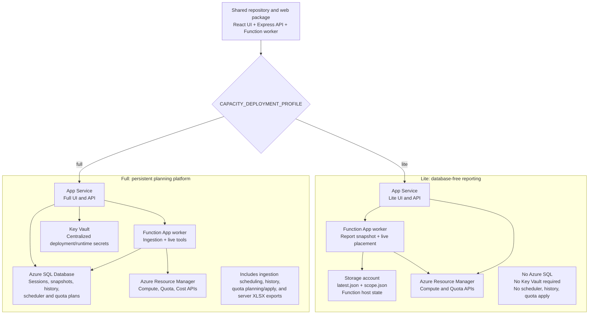

# Capacity Dashboard Deployment Profiles

The same web package and React bundle serve both deployment profiles. The App Service setting `CAPACITY_DEPLOYMENT_PROFILE` selects the active API surface and UI at runtime.

## Feature Boundary

| Capability | Lite | Full |
| --- | --- | --- |
| Capacity Grid and Region Matrix | Worker-generated Blob snapshot | SQL-backed current state |
| Capacity Spot Score and Recommender | Supported | Supported |
| Runtime Azure scope | `scope.json` plus RBAC | Deployment and scheduler configuration |
| Exports | Snapshot-filtered CSV | Client CSV and server CSV/XLSX |
| Historical analytics and scheduler | Not included | Included |
| Quota planning, simulation, and apply | Not included | Included |
| Azure SQL | Not deployed | Required |
| Key Vault | Optional hardening only | Used by the deployment/runtime design |